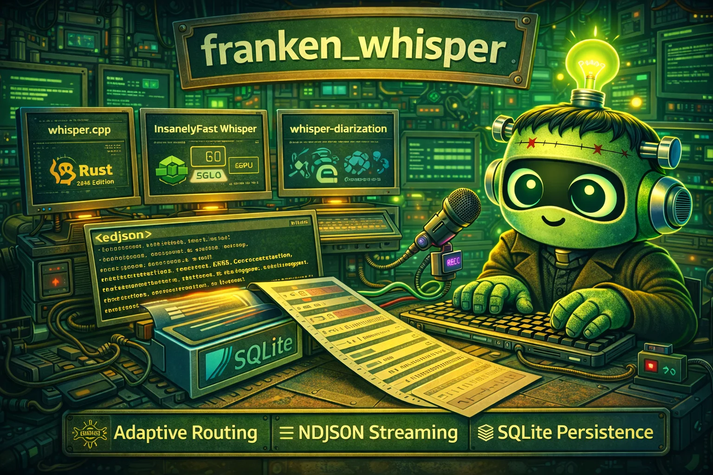

# franken_whisper

<div align="center">
  
</div>

<div align="center">

[](./LICENSE)
[](https://doc.rust-lang.org/edition-guide/rust-2024/)
[](https://github.com/rust-secure-code/safety-dance/)

</div>

**Agent-first Rust ASR orchestration stack with adaptive backend routing, real-time NDJSON streaming, and SQLite-backed persistence.**

---

## The Problem

Speech-to-text pipelines are fragmented. You need whisper.cpp for speed, insanely-fast-whisper for GPU batching, and whisper-diarization for speaker identification. Each has its own CLI, output format, error handling, and deployment story. Orchestrating them from scripts means parsing inconsistent stdout, handling timeouts manually, and losing run history.

Agent workflows need structured, streaming, machine-readable output, not human-oriented terminal decorations that break when piped.

## The Solution

franken_whisper is a single Rust binary that wraps all three backends behind a unified interface with:

- **Adaptive backend routing:** Bayesian decision contract selects the best engine per-request with explicit loss matrix, posterior calibration, and deterministic fallback
- **Real-time NDJSON streaming:** every pipeline stage emits sequenced, timestamped events with stable schema (v1.0.0) for agent consumption
- **Durable run history:** every transcription is persisted to SQLite with full event logs, replay envelopes, and JSONL export/import
- **Graceful cancellation:** Ctrl+C propagates through the entire pipeline via cancellation tokens with proper resource cleanup
- **TTY audio transport:** low-bandwidth audio relay over PTY links using mulaw+zlib+base64 NDJSON with handshake, integrity checks, and deterministic retransmission

## Why franken_whisper?

| Feature | whisper.cpp | insanely-fast-whisper | whisper-diarization | **franken_whisper** |
|---------|:-----------:|:---------------------:|:-------------------:|:-------------------:|
| Streaming output | partial | no | no | **NDJSON stage events** |
| Machine-readable errors | no | no | no | **structured error codes** |
| Adaptive backend selection | -- | -- | -- | **Bayesian routing** |
| Run persistence | no | no | no | **SQLite + JSONL** |
| Diarization | no | yes (HF token) | yes | **yes (any backend)** |
| GPU acceleration | CUDA/Metal | CUDA/MPS | CUDA | **frankentorch/frankenjax** |
| Cancellation support | SIGKILL | SIGKILL | SIGKILL | **graceful token-based** |
| TTY audio relay | no | no | no | **mulaw+zlib+b64 NDJSON** |
| Memory safety | C++ | Python | Python | **`#![forbid(unsafe_code)]`** |

---

## Quick Example

```bash
# Transcribe an audio file (JSON output)
cargo run -- transcribe --input meeting.mp3 --json

# Stream real-time pipeline events (agent mode)
cargo run -- robot run --input meeting.mp3 --backend auto

# Transcribe with speaker diarization
cargo run -- transcribe --input meeting.mp3 --diarize --hf-token "$HF_TOKEN" --json

# Discover available backends
cargo run -- robot backends

# Query run history
cargo run -- runs --limit 10 --format json

# Export runs to portable JSONL snapshot
cargo run -- sync export-jsonl --output ./snapshot

# TTY audio: encode, transmit over lossy link, decode
cargo run -- tty-audio encode --input audio.wav > frames.ndjson
cat frames.ndjson | cargo run -- tty-audio decode --output restored.wav
```

---

## Design Philosophy

### Agent-First, Human-Optional

Every command produces structured NDJSON on stdout. Human-friendly output is the exception (plain `transcribe` mode), not the rule. The `robot` subcommand is the primary interface. It emits sequenced stage events with stable schema versioning so upstream agents can parse output without fragile regex.

### Deterministic by Default

Given identical inputs and parameters, franken_whisper produces identical outputs. The retransmit loop, replay envelopes, and conformance harness all enforce determinism. Random elements (UUIDs, timestamps) are isolated to metadata fields, never to computational outputs.

### Fail Loud, Recover Gracefully

Every error has a structured code (`FW-IO`, `FW-CMD-TIMEOUT`, `FW-BACKEND-UNAVAILABLE`, etc.) and propagates through the NDJSON event stream. Cancellation tokens allow in-flight work to checkpoint and clean up rather than being killed mid-write.

### Composition Over Configuration

The 10-stage pipeline (Ingest, Normalize, VAD, Separate, Backend, Accelerate, Align, Punctuate, Diarize, Persist) is composed dynamically per-request. Stages are skipped when unnecessary, budgeted independently, and profiled automatically.

### No Unsafe Code

The entire codebase uses `#![forbid(unsafe_code)]`. Memory safety is enforced at the compiler level, not by convention.

---

## Comparison vs Alternatives

| Aspect | Raw whisper.cpp CLI | Python wrappers | **franken_whisper** |
|--------|:-------------------:|:---------------:|:-------------------:|
| Language | C++ | Python | Rust |
| Output format | text/VTT/SRT/JSON | JSON | NDJSON (streaming) |
| Backend switching | manual | manual | adaptive routing |
| Error codes | exit code only | exceptions | structured `FW-*` codes |
| Run history | none | none | SQLite + JSONL export |
| Timeout handling | none | none | per-stage budgets |
| Cancellation | SIGKILL | KeyboardInterrupt | `CancellationToken` |
| Resource cleanup | none guaranteed | GC-dependent | RAII + token checkpoints |
| Binary size (release) | ~5 MB | N/A (Python) | single static binary |
| Startup time | fast | slow (Python import) | fast |

---

## Installation

### From Source (Recommended)

```bash
git clone <repo-url>
cd franken_whisper

# minimal build
cargo build --release

# with TUI support
cargo build --release --features tui

# with GPU acceleration
cargo build --release --features gpu-frankentorch
cargo build --release --features gpu-frankenjax
```

The release profile is optimized for size (`opt-level = "z"`, LTO, single codegen unit, stripped symbols).

### Prerequisites

- **Rust nightly** (2024 edition)
- **ffmpeg**, required for audio normalization (must be on `$PATH`)
- **Backend binaries** (at least one):
  - `whisper-cli` (from whisper.cpp); override: `FRANKEN_WHISPER_WHISPER_CPP_BIN`
  - `insanely-fast-whisper` (Python); override: `FRANKEN_WHISPER_INSANELY_FAST_BIN`
  - `python3` with `pyannote.audio` (for diarization backend); override: `FRANKEN_WHISPER_PYTHON_BIN`
- **HuggingFace token** (for diarization): `--hf-token` or `FRANKEN_WHISPER_HF_TOKEN` / `HF_TOKEN`

### Path Dependencies

franken_whisper depends on sibling projects via Cargo path dependencies:

```
../asupersync          # orchestration, cancellation, decision contracts
../frankensqlite       # SQLite persistence (fsqlite crate)
../frankentui          # TUI (optional, feature: tui)
../frankentorch        # GPU acceleration (optional, feature: gpu-frankentorch)
../frankenjax          # GPU acceleration (optional, feature: gpu-frankenjax)
```

---

## Quick Start

### 1. Basic Transcription

```bash
# plain text output
cargo run -- transcribe --input audio.mp3

# full JSON report (includes segments, timing, backend info)
cargo run -- transcribe --input audio.mp3 --json

# specific backend
cargo run -- transcribe --input audio.mp3 --backend whisper_cpp --json

# with language hint
cargo run -- transcribe --input audio.mp3 --language ja --json
```

### 2. Robot Mode (Agent Integration)

```bash
# real-time NDJSON event stream
cargo run -- robot run --input audio.mp3 --backend auto
```

Output (one JSON object per line):
```json
{"event":"run_start","schema_version":"1.0.0","request":{"input":"audio.mp3","backend":"auto"}}
{"event":"stage","schema_version":"1.0.0","run_id":"...","seq":1,"stage":"ingest","code":"ingest.start","message":"materializing input"}
{"event":"stage","schema_version":"1.0.0","run_id":"...","seq":2,"stage":"normalize","code":"normalize.ok","message":"audio normalized"}
{"event":"run_complete","schema_version":"1.0.0","run_id":"...","backend":"whisper_cpp","transcript":"Hello world..."}
```

### 3. Speaker Diarization

```bash
cargo run -- transcribe \
  --input meeting.mp3 \
  --diarize \
  --hf-token "$HF_TOKEN" \
  --min-speakers 2 \
  --max-speakers 5 \
  --json
```

### 4. Microphone Capture

```bash
# record 30 seconds from default mic
cargo run -- transcribe --mic --mic-seconds 30 --json

# specific device
cargo run -- transcribe --mic --mic-device "hw:0" --json
```

### 5. Stdin Input

```bash
# pipe audio bytes
cat audio.mp3 | cargo run -- transcribe --stdin --json
```

---

## Command Reference

### `transcribe`

Core transcription command. Runs the full pipeline: ingest, normalize, backend execution, optional acceleration, and persistence.

```bash
cargo run -- transcribe [OPTIONS]
```

**Input (mutually exclusive):**

| Flag | Description |
|------|-------------|
| `--input <PATH>` | Audio/video file path |
| `--stdin` | Read audio bytes from stdin |
| `--mic` | Capture from microphone via ffmpeg |

**Backend & Model:**

| Flag | Default | Description |
|------|---------|-------------|
| `--backend <KIND>` | `auto` | `auto`, `whisper_cpp`, `insanely_fast`, `whisper_diarization` |
| `--model <MODEL>` | backend-specific | Model name/path forwarded to backend |
| `--language <LANG>` | auto-detect | Language hint (ISO 639-1) |
| `--translate` | false | Translate to English |
| `--diarize` | false | Enable speaker diarization |

**Output:**

| Flag | Description |
|------|-------------|
| `--json` | Full JSON run report |
| `--output-txt` | Plain text (whisper.cpp) |
| `--output-vtt` | WebVTT subtitles |
| `--output-srt` | SRT subtitles |
| `--output-csv` | CSV |
| `--output-json-full` | Extended JSON with metadata |
| `--output-lrc` | LRC karaoke format |

**Storage:**

| Flag | Default | Description |
|------|---------|-------------|
| `--db <PATH>` | `.franken_whisper/storage.sqlite3` | SQLite database path |
| `--no-persist` | false | Skip persistence |

**Inference Tuning (whisper.cpp):**

| Flag | Default | Description |
|------|---------|-------------|
| `--threads <N>` | 4 | Computation threads |
| `--processors <N>` | 1 | Parallel processors |
| `--no-gpu` | false | Force CPU-only |
| `--beam-size <N>` | 5 | Beam search width |
| `--best-of <N>` | 5 | Sampling candidates |
| `--temperature <F>` | 0.0 | Sampling temperature |
| `--no-timestamps` | false | Suppress timestamps |
| `--vad` | false | Enable Voice Activity Detection |

**Batching (insanely-fast-whisper):**

| Flag | Default | Description |
|------|---------|-------------|
| `--batch-size <N>` | 24 | Parallel inference batch size |
| `--gpu-device <DEV>` | auto | GPU device (`0`, `cuda:0`, `mps`) |
| `--flash-attention` | false | Enable Flash Attention 2 |
| `--hf-token <TOKEN>` | env | HuggingFace token for diarization |
| `--timestamp-level` | `chunk` | `chunk` or `word` granularity |

**Diarization:**

| Flag | Description |
|------|-------------|
| `--num-speakers <N>` | Exact speaker count |
| `--min-speakers <N>` | Minimum speakers |
| `--max-speakers <N>` | Maximum speakers |
| `--no-stem` | Disable vocal isolation |
| `--suppress-numerals` | Spell out numbers for alignment |

### `robot`

Agent-first interface with structured NDJSON output.

```bash
# streaming transcription with stage events
cargo run -- robot run [TRANSCRIBE_OPTIONS]

# emit JSON schema for all event types
cargo run -- robot schema

# discover backends and capabilities
cargo run -- robot backends

# query routing decision history
cargo run -- robot routing-history [--run-id <ID>] [--limit 20]
```

**Robot Event Types:**

| Event | Description |
|-------|-------------|
| `run_start` | Request accepted, pipeline starting |
| `stage` | Pipeline stage progress (sequenced, timestamped) |
| `run_complete` | Transcription finished with full result |
| `run_error` | Pipeline failed with structured error code |
| `backends` | Backend discovery response |

**Stage Codes:**

Stages emit paired `*.start` / `*.ok` codes (or `*.error` on failure):

`ingest.start`, `ingest.ok`, `normalize.start`, `normalize.ok`, `backend.start`, `backend.ok`, `accelerate.start`, `accelerate.ok`, `persist.start`, `persist.ok`, `orchestration.latency_profile`

### `runs`

Query persisted run history.

```bash
cargo run -- runs [--limit 20] [--format plain|json|ndjson] [--id <RUN_ID>]
```

| Flag | Default | Description |
|------|---------|-------------|
| `--limit <N>` | 20 | Max recent runs |
| `--format` | `plain` | `plain` (table), `json` (pretty), `ndjson` (streaming) |
| `--id <UUID>` | -- | Fetch specific run details |

### `sync`

One-way JSONL snapshot export/import.

```bash
# export
cargo run -- sync export-jsonl --output ./snapshot [--db <PATH>]

# import
cargo run -- sync import-jsonl --input ./snapshot --conflict-policy reject|skip|overwrite
```

Export produces: `runs.jsonl`, `segments.jsonl`, `events.jsonl`, `manifest.json` (with SHA-256 checksums).

### `tty-audio`

Low-bandwidth audio transport over TTY/PTY links using the `mulaw+zlib+b64` NDJSON protocol.

```bash
# encode audio to NDJSON frames
cargo run -- tty-audio encode --input audio.wav [--chunk-ms 200]

# decode NDJSON frames to WAV
cat frames.ndjson | cargo run -- tty-audio decode --output restored.wav [--recovery fail_closed|skip_missing]

# generate retransmit plan from lossy stream
cat frames.ndjson | cargo run -- tty-audio retransmit-plan

# emit individual control frames
cargo run -- tty-audio control handshake
cargo run -- tty-audio control ack --up-to-seq 42
cargo run -- tty-audio control backpressure --remaining-capacity 64
cargo run -- tty-audio control retransmit-request --sequences 1,2,4
cargo run -- tty-audio control retransmit-response --sequences 1,2,4

# automated retransmit loop with strategy escalation
cat frames.ndjson | cargo run -- tty-audio control retransmit-loop --rounds 3

# convenience shorthands
cargo run -- tty-audio send-control handshake|eof|reset
cat frames.ndjson | cargo run -- tty-audio retransmit --rounds 3
```

**Recovery Strategies:**

The retransmit loop escalates recovery effort across rounds:

```
Simple (1 frame/round) -> Redundant (2 frames/round) -> Escalate (4 frames/round)
```

**Integrity Checks:**

Each frame carries optional CRC32 and SHA-256 hashes of raw (pre-compression) audio bytes. Mismatches cause frame drops (skip_missing) or stream failure (fail_closed).

See [`docs/tty-audio-protocol.md`](docs/tty-audio-protocol.md) for the full protocol specification.
For operator replay/framing guarantees, see
[`docs/tty-replay-guarantees.md`](docs/tty-replay-guarantees.md).

### `tui`

Interactive TUI for human operators (feature-gated).

```bash
cargo run --features tui -- tui
```

Provides runs list, timeline view, and event detail panes powered by `frankentui`.

---

## Configuration

### Environment Variables

| Variable | Default | Description |
|----------|---------|-------------|
| `FRANKEN_WHISPER_WHISPER_CPP_BIN` | `whisper-cli` | whisper.cpp binary name/path |
| `FRANKEN_WHISPER_INSANELY_FAST_BIN` | `insanely-fast-whisper` | insanely-fast-whisper binary |
| `FRANKEN_WHISPER_PYTHON_BIN` | `python3` | Python interpreter for diarization |
| `FRANKEN_WHISPER_HF_TOKEN` | -- | HuggingFace token (preferred over `HF_TOKEN`) |
| `HF_TOKEN` | -- | HuggingFace token (fallback) |
| `FRANKEN_WHISPER_DIARIZATION_DEVICE` | -- | GPU device for diarization backend |
| `FRANKEN_WHISPER_STATE_DIR` | `.franken_whisper` | State directory root |
| `FRANKEN_WHISPER_DB` | `.franken_whisper/storage.sqlite3` | SQLite database path |
| `FRANKEN_WHISPER_NATIVE_EXECUTION` | `0` | Enable native in-process engine dispatch (`1`/`true`) |
| `FRANKEN_WHISPER_NATIVE_ROLLOUT_STAGE` | `primary` | Native engine rollout stage |
| `RUST_LOG` | -- | tracing filter (e.g. `franken_whisper=debug`) |

### Cargo Features

| Feature | Description |
|---------|-------------|
| `tui` | Enable interactive TUI via frankentui |
| `gpu-frankentorch` | Enable frankentorch GPU acceleration |
| `gpu-frankenjax` | Enable frankenjax GPU acceleration |

No features are enabled by default.

### Backend Routing

The `auto` backend uses adaptive Bayesian routing:

**Non-diarization priority:** `whisper_cpp` > `insanely_fast` > `whisper_diarization`

**Diarization priority:** `insanely_fast` > `whisper_diarization` > `whisper_cpp`

Each `auto` run emits a `backend.routing.decision_contract` stage event with explicit state/action/loss/posterior/calibration terms. The router falls back to deterministic static priority when calibration score drops below 0.3 or Brier score exceeds 0.35.

### Native Engine Rollout

Native Rust engine replacements follow a staged rollout:

| Stage | Behavior |
|-------|----------|
| `shadow` | Deterministic bridge execution only; native conformance validated out-of-band |
| `validated` | Deterministic bridge execution only with stricter conformance gating |
| `fallback` | Deterministic bridge execution only; fallback policy and evidence paths hardened |
| `primary` | Native preferred with deterministic bridge fallback (requires `FRANKEN_WHISPER_NATIVE_EXECUTION=1`) |
| `sole` | Native only (requires `FRANKEN_WHISPER_NATIVE_EXECUTION=1`) |

Routing and execution are jointly controlled by:
- `FRANKEN_WHISPER_NATIVE_ROLLOUT_STAGE` (stage policy)
- `FRANKEN_WHISPER_NATIVE_EXECUTION` (whether native dispatch is enabled at runtime)

`backend.ok` and `replay.envelope` stage payloads include explicit execution-path metadata:
`implementation`, `execution_mode`, `native_rollout_stage`, and `native_fallback_error`.

Conformance harness enforces 50ms canonical timestamp tolerance and emits `target/conformance/bridge_native_conformance_bundle.json`.

---

## Architecture

```
                           ┌─────────────────────────┐
                           │      CLI / Robot         │
                           │   (clap + NDJSON emit)   │
                           └────────────┬────────────┘
                                        │
                           ┌────────────▼────────────┐
                           │  FrankenWhisperEngine    │
                           │   (orchestrator.rs)      │
                           │                          │
                           │  10-Stage Pipeline:      │
                           │  1. Ingest               │
                           │  2. Normalize (ffmpeg)   │
                           │  3. VAD                  │
                           │  4. Source Separate       │
                           │  5. Backend Execution    │
                           │  6. Accelerate (GPU)     │
                           │  7. Alignment            │
                           │  8. Punctuation          │
                           │  9. Diarization          │
                           │ 10. Persist              │
                           └────┬───────┬───────┬────┘
                                │       │       │
                  ┌─────────────▼─┐ ┌───▼───┐ ┌─▼──────────────┐
                  │   Backends    │ │ Accel │ │   Storage      │
                  │               │ │       │ │                │
                  │ whisper.cpp   │ │ frank │ │ fsqlite        │
                  │ insanely-fast │ │ torch │ │ (SQLite WAL)   │
                  │ whisper-diar  │ │ frank │ │                │
                  │ native pilots │ │  jax  │ │ JSONL export   │
                  └───────────────┘ └───────┘ └────────────────┘

  ┌──────────────────┐    ┌──────────────────┐    ┌──────────────────┐
  │   TTY Audio      │    │   Conformance    │    │   Replay         │
  │                  │    │                  │    │                  │
  │ mulaw+zlib+b64   │    │ 50ms tolerance   │    │ SHA-256 content  │
  │ NDJSON transport │    │ cross-engine     │    │ hash envelopes   │
  │ handshake/retry  │    │ comparator       │    │ drift detection  │
  └──────────────────┘    └──────────────────┘    └──────────────────┘
```

### Data Flow

1. **Ingest:** Materialize input from file, stdin, or microphone capture
2. **Normalize:** Convert to 16kHz mono WAV via ffmpeg subprocess
3. **VAD:** (Optional) Voice Activity Detection to skip silence
4. **Source Separate:** (Optional) Vocal isolation for cleaner transcription
5. **Backend:** Dispatch to selected engine (adaptive routing or explicit)
6. **Accelerate:** (Optional) GPU confidence normalization via frankentorch/frankenjax
7. **Alignment:** (Optional) Forced alignment for word-level timestamps
8. **Punctuation:** (Optional) Punctuation restoration
9. **Diarization:** (Optional) Speaker identification and labeling
10. **Persist:** Write run report, segments, and events to SQLite

Each stage emits `*.start` and `*.ok` events to the NDJSON stream with timing, sequence numbers, and structured payloads.

---

## Technical Details

### Bayesian Backend Router

When `--backend auto` is selected, franken_whisper uses a formal Bayesian decision contract to choose the best engine for each request rather than trying backends in a fixed order.

**State Space (3 states):**
- `all_available`: all three backends found on PATH and responsive
- `partial_available`: 1-2 backends operational
- `none_available`: nothing usable

**Action Space (4 actions):**
- `try_whisper_cpp`, `try_insanely_fast`, `try_diarization` (reordered per-request based on `--diarize`)
- `fallback_error`: return structured error when nothing is available

**Loss Matrix:**

The router maintains a 3x4 loss matrix (states x actions). Each cell contains an expected cost computed from three weighted factors:

```
cost = (0.45 x latency_cost) + (0.35 x quality_cost) + (0.20 x failure_cost)
```

- **Latency cost** scales with audio duration (short/medium/long buckets) and backend latency proxy
- **Quality cost** depends on backend capability relative to the request (diarization support, GPU availability)
- **Failure cost** is `(1.0 - p_success) x 100`, where `p_success` comes from the Bayesian posterior

Availability penalties push costs sharply when backends are missing: +333 for partial availability, +1000 for none.

**Bayesian Posterior:**

Each backend starts with a Beta distribution prior reflecting expected reliability:

| Backend | Prior | Interpretation |
|---------|-------|----------------|
| whisper_cpp | Beta(7, 3) | Strong expectation of success |
| insanely_fast | Beta(6, 4) | Moderate expectation |
| whisper_diarization | Beta(5, 5) | Weakest prior (most uncertain) |

After each run, the posterior is updated with the observed outcome. Over time, backends that succeed frequently get stronger posteriors and lower costs.

**Calibration & Fallback:**

The router tracks a sliding window of 50 prediction-outcome pairs and computes a Brier score:

```
Brier = (1/N) x sum((predicted_i - actual_i)^2)
```

The adaptive router falls back to deterministic static priority when any of these hold:
- Fewer than 5 observations (insufficient data)
- Calibration score < 0.3 (posterior margin too narrow)
- Brier score > 0.35 (predictions don't match reality)

This guarantees the system never makes worse decisions than a simple priority list, even when the Bayesian model is poorly calibrated.

**Evidence Ledger:**

Every routing decision is recorded in a circular buffer (capacity: 200 entries) containing the decision ID, trace ID, observed state, chosen action, posterior snapshot, calibration metrics, and whether fallback was triggered. This ledger is queryable via `robot routing-history` and persisted in stage event payloads for post-hoc analysis.

### Pipeline Stage Budgets

Each pipeline stage runs under an independent millisecond budget enforced via `asupersync::time::timeout`. Default budgets:

| Stage | Budget | Rationale |
|-------|--------|-----------|
| Ingest | 15s | File I/O or mic capture |
| Normalize | 180s | ffmpeg transcode (large files) |
| VAD | 10s | Lightweight energy detection |
| Source Separate | 30s | Demucs-style vocal isolation |
| Backend | 900s (15 min) | Full inference (long audio on CPU) |
| Accelerate | 20s | GPU confidence normalization |
| Align | 30s | CTC forced alignment |
| Punctuate | 10s | Punctuation model inference |
| Diarize | 30s | Speaker clustering |
| Persist | 20s | SQLite transaction |
| Cleanup | 5s | Finalizer timeout |

Every budget is overridable via `FRANKEN_WHISPER_STAGE_BUDGET_<STAGE>_MS` environment variables.

**Automatic Latency Profiling:**

After each run, the orchestrator emits an `orchestration.latency_profile` stage event with per-stage timing decomposition:

- **queue_ms**: time waiting before stage starts
- **service_ms**: actual work time
- **external_process_ms**: subprocess wall time (ffmpeg, whisper-cli)
- **p50_ms / p95_ms / p99_ms**: quantile estimates from the current session

The profiler computes a utilization ratio (`service_ms / budget_ms`) and emits deterministic tuning recommendations:

| Utilization | Recommendation |
|-------------|----------------|
| <= 30% | `decrease_budget_candidate` |
| 30-90% | `keep_budget` |
| >= 90% | `increase_budget` (suggest 1.25x current) |

### Replay Envelopes & Drift Detection

Every completed run produces a `ReplayEnvelope` containing four SHA-256 hashes:

```
┌──────────────────────────────────────────────┐
│              ReplayEnvelope                  │
├──────────────────────────────────────────────┤
│ input_content_hash:  SHA-256(normalized WAV) │
│ backend_identity:    "whisper-cli-v1.7.2"    │
│ backend_version:     "1.7.2"                 │
│ output_payload_hash: SHA-256(raw backend JSON)│
└──────────────────────────────────────────────┘
```

Given identical input audio and the same backend version, the output hash should be identical. If it changes between runs, something drifted: a model update, a parameter change, or a non-determinism in the backend. The conformance harness uses replay comparison reports to flag regressions automatically:

- `input_hash_match`: did the input change?
- `backend_identity_match`: same binary?
- `backend_version_match`: same version?
- `output_hash_match`: same transcription?

All four must match for `within_tolerance()` to return true.

### Conformance Harness

The conformance module enforces cross-engine compatibility using a 50ms canonical timestamp tolerance (`CANONICAL_TIMESTAMP_TOLERANCE_SEC = 0.05`). This is the single source of truth for how much timing drift is acceptable between bridge adapters and native engines.

**Segment Comparison:**

The comparator aligns expected vs. observed segment lists and counts violations:

| Violation Type | Condition |
|----------------|-----------|
| Text mismatch | Segment text differs at same index |
| Speaker mismatch | Speaker label differs (optional check) |
| Timestamp violation | start/end differs by > 50ms |
| Length mismatch | Different segment counts |

A `SegmentComparisonReport` with zero violations and matching lengths passes the conformance gate.

**Overlap Detection:**

The `SegmentConformancePolicy` can optionally reject overlapping segments, where one segment's `end_sec` exceeds the next segment's `start_sec` beyond a configurable epsilon (default: 1 microsecond). This catches backends that produce garbled timeline output.

### Confidence Normalization (Acceleration)

The acceleration stage normalizes per-segment confidence scores into a proper probability distribution. This matters because raw backend confidences are often uncalibrated; whisper.cpp and insanely-fast-whisper use different scoring scales.

**Algorithm:**

1. Extract confidence values from all segments
2. Replace missing/invalid values (NaN, infinity) with a text-length-based baseline: `ln(1 + char_count) + 1.0`
3. Compute pre-mass: `sum(confidences)` before normalization
4. Apply softmax normalization (GPU path via frankentorch/frankenjax, or CPU fallback)
5. Compute post-mass: `sum(normalized)` (should equal 1.0)
6. Record both masses in the `AccelerationReport` for validation

The CPU fallback uses safe division: `value / sum` with a guard for near-zero sums (falls back to uniform `1/N`).

**Acceleration Paths:**

| Path | Trigger | Method |
|------|---------|--------|
| frankentorch | `--features gpu-frankentorch` | Tensor softmax via `ft_api::FrankenTorchSession` |
| frankenjax | `--features gpu-frankenjax` | JAX-based normalization via `fj_api` |
| CPU fallback | no GPU features | Safe division with NaN/inf guards |

### Audio Normalization Pipeline

All input audio passes through ffmpeg before reaching any backend:

```bash
ffmpeg -hide_banner -loglevel error -y \
  -i <input> \
  -ar 16000 -ac 1 -c:a pcm_s16le \
  <output_normalized_16k_mono.wav>
```

This produces a standardized 16 kHz, mono, 16-bit PCM WAV regardless of input format. The normalize stage handles:

- Any format ffmpeg can decode (MP3, FLAC, OGG, M4A, video files with audio tracks, etc.)
- Sample rate conversion (44.1 kHz, 48 kHz, etc. down to 16 kHz)
- Channel mixing (stereo/surround to mono)
- Codec conversion to raw PCM

Microphone capture uses OS-specific ffmpeg sources:

| OS | Format | Default Device |
|----|--------|----------------|
| Linux | `alsa` | `default` |
| macOS | `avfoundation` | `:0` |
| Windows | `dshow` | `audio=default` |

### Storage Internals

The storage layer uses `fsqlite` (from the frankensqlite project) with three tables:

```sql
runs     (run_id PK, started_at, finished_at, backend, input_path,
          request_json, result_json, transcript, replay_json, ...)

segments (run_id FK, idx, start_sec, end_sec, speaker, text, confidence)

events   (run_id FK, seq, ts_rfc3339, stage, code, message, payload_json)
```

**Atomic Persistence with Retry:**

The `persist_report` function wraps all inserts (run + segments + events) in a single transaction. If SQLite returns "database is busy" (concurrent writer), it retries with exponential backoff:

- 8 retry attempts
- Backoff delay: `5ms x (attempt + 1)` (5ms, 10ms, 15ms, ... 40ms)
- Cancellation token checked before each COMMIT; if the pipeline deadline expired, the transaction rolls back cleanly

**Cancellation-Safe Writes:**

The token checkpoint pattern ensures no partial data reaches the database:

```
BEGIN TRANSACTION
  INSERT INTO runs ...
  INSERT INTO segments ... (N rows)
  INSERT INTO events ... (M rows)
  token.checkpoint()?  <-- rolls back if cancelled
COMMIT
```

### Sync Architecture

The sync module provides one-way JSONL snapshot export/import with distributed lock safety.

**Lock Protocol:**

Before any export or import, a JSON lock file is created at `{state_root}/locks/sync.lock`:

```json
{"pid": 12345, "created_at_rfc3339": "2026-02-22T12:00:00Z", "operation": "export"}
```

Stale lock detection checks two conditions:
1. Is the PID still alive? (reads `/proc/{pid}` on Linux)
2. Is the lock older than 5 minutes?

If either check fails, the lock is archived with a reason suffix and a new lock is acquired.

**Export Format:**

An export produces four files:

```
snapshot/
  runs.jsonl        # one JSON object per run
  segments.jsonl    # one JSON object per segment
  events.jsonl      # one JSON object per event
  manifest.json     # metadata + SHA-256 checksums
```

The manifest contains row counts and SHA-256 checksums of each JSONL file, enabling integrity verification on import. Incremental exports use a cursor file (`exports/cursor.json`) tracking the last export timestamp to avoid re-exporting unchanged data.

**Conflict Policies:**

| Policy | Behavior on duplicate run_id |
|--------|------------------------------|
| `reject` | Fail the entire import |
| `skip` | Silently skip existing runs |
| `overwrite` | Replaces conflicting `runs` rows, but fails closed if strict replacement would require child-row `UPDATE`/`DELETE` on `segments`/`events` |

Current runtime guidance: for guaranteed strict replacement imports, target an empty database (or a freshly rebuilt DB from snapshot) rather than mutating existing child rows in-place.

### TTY Audio: Adaptive Bitrate & FEC

The TTY audio module goes beyond simple encode/decode. The `AdaptiveBitrateController` monitors link quality in real time and adjusts compression dynamically:

| Frame Loss Rate | Link Quality | Compression | Critical Frame FEC |
|-----------------|--------------|-------------|-------------------|
| < 1% | High | zlib level 1 (fast) | 1x (no duplication) |
| 1% - 10% | Moderate | zlib level 6 (default) | 2x |
| > 10% | Poor | zlib level 9 (best) | 3x |

**Critical Frame FEC (Forward Error Correction):**

Control frames essential for protocol correctness (handshake, session_close, ack) are emitted multiple times based on the current link quality. Under 10% loss, every handshake frame is transmitted 3 times to ensure at least one copy arrives. This is a probabilistic reliability guarantee: with independent frame loss at rate `p`, the probability all `k` copies are lost is `p^k`.

**Link Quality Assessment:**

The controller maintains running `frames_sent` and `frames_lost` counters. After each delivery attempt, it recalculates:

```
frame_loss_rate = frames_lost / frames_sent
link_quality = 1.0 - frame_loss_rate
```

Quality transitions trigger compression level changes on subsequent frames, providing automatic adaptation without manual tuning.

### Graceful Shutdown

franken_whisper's shutdown path is designed to never leave the system in an inconsistent state.

**Signal Flow:**

```
Ctrl+C
  │
  ▼
ctrlc handler
  │ sets AtomicBool (SeqCst)
  │ calls optional callback
  ▼
CancellationToken.checkpoint()
  │ returns Err(Cancelled) at next checkpoint
  ▼
Pipeline stage catches Cancelled
  │ rolls back any in-progress transaction
  │ cleans up temp files via finalizers
  ▼
FrankenWhisperEngine
  │ runs all registered finalizers (bounded to 5s)
  │ emits run_error event with FW-CANCELLED code
  ▼
CLI exits with code 130 (128 + SIGINT)
```

Stages don't catch signals directly. Instead, they poll `token.checkpoint()` at safe points: between loop iterations, before COMMIT, after subprocess completion. This cooperative cancellation model ensures:

1. No half-written SQLite rows (transactions roll back)
2. No orphaned ffmpeg/whisper-cli subprocesses (killed on token cancellation)
3. No leaked temp files (finalizers run within bounded timeout)
4. Deterministic exit code (130 for signal, vs. other codes for errors)

### Error Codes

| Code | Meaning |
|------|---------|
| `FW-IO` | I/O error (file not found, permission denied) |
| `FW-JSON` | JSON serialization/deserialization failure |
| `FW-CMD-MISSING` | Required external binary not found on PATH |
| `FW-CMD-FAILED` | Backend subprocess exited with non-zero status |
| `FW-CMD-TIMEOUT` | Backend subprocess exceeded timeout |
| `FW-BACKEND-UNAVAILABLE` | No suitable backend found for request |
| `FW-INVALID-REQUEST` | Malformed or contradictory request parameters |
| `FW-STORAGE` | SQLite persistence error |
| `FW-UNSUPPORTED` | Requested feature not available |
| `FW-MISSING-ARTIFACT` | Expected output file not produced by backend |
| `FW-CANCELLED` | Operation cancelled via token or Ctrl+C |
| `FW-STAGE-TIMEOUT` | Pipeline stage exceeded its budget |

---

## Codebase Statistics

| Metric | Value |
|--------|-------|
| Total source lines (src/) | 107,244 |
| Library tests | 2,026+ |
| Integration test files | 17 |
| Benchmark suites | 5 (criterion) |
| Public modules | 15 |
| Error variants | 12 (each with structured code) |
| Backend engines | 6 (3 bridge + 3 native pilot) |
| Pipeline stages | 10 |
| CLI subcommands | 6 (transcribe, robot, runs, sync, tty-audio, tui) |
| TTY control frame types | 7 (handshake, ack, backpressure, retransmit req/resp, session close, handshake ack) |
| Clippy lints enforced | 7 targeted + deny unsafe_code |
| Cargo features | 3 (tui, gpu-frankentorch, gpu-frankenjax) |
| Release optimizations | opt-level z, LTO, single codegen unit, panic=abort, stripped |

---

## Troubleshooting

### "FW-CMD-MISSING: whisper-cli not found"

No backend binary is on your PATH. Install at least one:

```bash
# whisper.cpp
brew install whisper-cpp   # macOS
# or build from source: https://github.com/ggerganov/whisper.cpp

# or override the binary name
export FRANKEN_WHISPER_WHISPER_CPP_BIN=/path/to/whisper-cli
```

### "FW-BACKEND-UNAVAILABLE: diarization requires HF token"

Diarization needs a HuggingFace API token for pyannote models:

```bash
export FRANKEN_WHISPER_HF_TOKEN="hf_your_token_here"
# or pass directly
cargo run -- transcribe --input audio.mp3 --diarize --hf-token "hf_..."
```

### "FW-CMD-TIMEOUT: backend exceeded timeout"

The backend took longer than the allowed duration:

```bash
# increase timeout (seconds)
cargo run -- transcribe --input long_audio.mp3 --timeout 600 --json
```

### Robot mode outputs nothing

Ensure you're using the `robot run` subcommand, not just `robot`:

```bash
cargo run -- robot run --input audio.mp3 --backend auto
```

### SQLite "database is locked"

Another franken_whisper process is writing. The storage layer retries with exponential backoff (5-40ms), but simultaneous heavy writes may conflict. Use `--no-persist` to skip persistence, or use separate `--db` paths.

### "safe legacy runs migration failed"

When opening older DBs missing `runs.replay_json` / `runs.acceleration_json`, franken_whisper now attempts a snapshot/rebuild/swap migration with rollback safety and integrity checks.

If that migration still fails (for example due severe on-disk corruption), recover via snapshot:

1. Preserve the original DB as immutable evidence.
2. Export from a known-good source snapshot (or recover from existing JSONL export).
3. Create a fresh target DB.
4. Import via:

```bash
cargo run -- sync import-jsonl --input ./snapshot --conflict-policy reject
```

For strict overwrite flows, prefer importing into an empty DB rather than mutating legacy child rows in-place.

---

## Limitations

- **Backend binaries required.** franken_whisper orchestrates external ASR engines; it does not include inference runtimes. You need whisper.cpp, insanely-fast-whisper, or whisper-diarization installed.
- **ffmpeg required.** Audio normalization depends on ffmpeg being on PATH. There is no built-in audio decoder.
- **Path dependencies.** The project depends on sibling Cargo workspace members (`asupersync`, `frankensqlite`, etc.) via relative paths. It is not published to crates.io as a standalone crate.
- **Native engines are pilots.** Native Rust engine implementations are deterministic conformance pilots. They can execute in-process when `FRANKEN_WHISPER_NATIVE_EXECUTION=1` and rollout stage is `primary|sole`; otherwise bridge adapters remain active.
- **No bidirectional sync.** JSONL export/import is one-way. There is no merge or conflict resolution beyond the explicit `--conflict-policy` flag.
- **Legacy schema migration is rollback-safe but not magic.** Legacy `runs` schemas are migrated through snapshot/rebuild/swap with integrity checks; severely corrupted DBs may still require JSONL restore into a fresh DB.
- **Overwrite import is fail-closed for child-row mutation.** When strict replacement would require child-row `UPDATE`/`DELETE` on `segments`/`events`, import errors by design; use an empty target DB for strict replacement workflows.
- **Single-machine.** Designed for single-machine use with local SQLite. No distributed or multi-node support.

---

## Testing

107,000+ lines of Rust with 2,000+ tests across unit, integration, and conformance suites.

```bash
# run all library tests
cargo test --lib

# run specific test module
cargo test --lib -- backend::tests
cargo test --lib -- robot::tests
cargo test --lib -- tty_audio::tests

# run integration tests
cargo test --test tty_telemetry_tests
cargo test --test conformance_comparator_tests
cargo test --test gpu_cancellation_tests
cargo test --test robot_contract_tests
cargo test --test e2e_pipeline_tests

# run benchmarks
cargo bench --bench storage_bench
cargo bench --bench normalize_bench
cargo bench --bench pipeline_bench
cargo bench --bench tty_bench
cargo bench --bench sync_bench

# lint (lib targets; some test targets have pre-existing warnings from in-progress work)
cargo clippy --lib -- -D warnings
```

### Test Categories

| Category | Count | Description |
|----------|-------|-------------|
| Backend engine tests | 260+ | Engine trait compliance, native pilot validation |
| Robot contract tests | 150+ | NDJSON schema validation, field presence |
| TTY audio tests | 109 | Handshake, integrity, retransmit, telemetry |
| Conformance tests | 80+ | Cross-engine tolerance, replay envelopes |
| Storage tests | 100+ | SQLite roundtrip, concurrent writes, recovery |
| GPU cancellation tests | 42 | Stream ownership, fence payloads, fallback |
| Conformance comparator | 25 | Drift metrics, WER, shadow-run modes |
| E2E pipeline tests | -- | Full pipeline from input to persisted result |

---

## FAQ

**Q: Do I need all three backends installed?**

No. franken_whisper works with any single backend. The `auto` router will use whatever is available. You can also force a specific backend with `--backend whisper_cpp`.

**Q: What audio formats are supported?**

Anything ffmpeg can decode. The normalize stage converts all input to 16kHz mono WAV before passing to backends.

**Q: Can I use this as a library?**

Yes. `franken_whisper` is both a library crate and a binary. The public API exposes all modules: `backend`, `orchestrator`, `robot`, `storage`, `tty_audio`, `conformance`, etc.

**Q: What's the "replay envelope"?**

Each run produces a `ReplayEnvelope` containing SHA-256 hashes of the input content, backend identity, and output payload. This allows detecting drift when re-running the same input. If the output hash changes, something in the pipeline changed.

**Q: How does cancellation work?**

Ctrl+C sets a global shutdown flag. The `CancellationToken` from `asupersync` propagates through every pipeline stage. Each stage calls `token.checkpoint()` at safe points, which returns `Err(Cancelled)` if shutdown was requested. This ensures no partial writes to SQLite and no orphaned subprocess resources.

**Q: What's the TTY audio module for?**

It enables audio transport over constrained TTY/PTY links where binary data can't flow directly. Audio is compressed (mu-law + zlib), base64-encoded, and transmitted as NDJSON lines with sequence numbers, CRC32, and SHA-256 integrity. A handshake protocol negotiates version and codec, and a retransmit loop recovers lost frames with escalating recovery strategies.

**Q: How does the Bayesian router differ from a simple priority list?**

A priority list always tries backends in the same order. The Bayesian router learns from outcomes: if whisper_cpp starts failing (bad model, corrupted binary), its posterior degrades and the router automatically shifts traffic to insanely_fast. The loss matrix also considers request-specific factors like audio duration and whether diarization was requested. When the router doesn't have enough data (< 5 observations) or its predictions are poorly calibrated (Brier score > 0.35), it falls back to the static priority list automatically. The result is adaptive routing when the model is well-calibrated, with automatic fallback to static priority when it isn't.

**Q: What happens if I Ctrl+C during a long transcription?**

The shutdown controller sets a global atomic flag and propagates cancellation through the pipeline. The currently active stage finishes its current checkpoint boundary (never mid-write), rolls back any uncommitted SQLite transaction, kills any running subprocess (ffmpeg, whisper-cli), runs registered finalizers within a 5-second bounded timeout, and exits with code 130. No data corruption, no orphaned processes, no leaked temp files.

**Q: What's the "alien-artifact engineering contract"?**

A design discipline for adaptive/runtime decision systems. Every adaptive controller in franken_whisper (the backend router, the bitrate controller, the budget tuner) must declare an explicit state space, action space, loss matrix, posterior/confidence terms, calibration metric, deterministic fallback trigger, and evidence ledger artifact. No adaptive behavior ships without a conservative fallback, which prevents the system from making unbounded bad decisions when its model is wrong.

**Q: How are native engines different from bridge adapters?**

Bridge adapters spawn external processes (whisper-cli, python3) and parse their stdout/stderr. Native engines run in-process as deterministic Rust code. Both implement the same `Engine` trait and produce identical `TranscriptionResult` types. Native engines use the `<backend>-native` naming convention (e.g., `whisper.cpp-native`), return the same `BackendKind` as their bridge counterpart, and must declare a capability superset of the bridge. The rollout from bridge to native follows a 5-stage progression (shadow, validated, fallback, primary, sole) with conformance gating at each stage.

**Q: Why SQLite instead of Postgres/Redis/files?**

SQLite fits a single-machine CLI tool well: zero configuration, no daemon, ACID transactions, concurrent reads via WAL mode, and the entire database is a single file that's easy to backup or move. The `fsqlite` crate provides a Rust-native interface without depending on the system `libsqlite3`. JSONL export/import covers portability: export to files, import on another machine, share via git.

**Q: How does the TTY audio retransmit loop guarantee determinism?**

The `RetransmitLoop` struct is fully deterministic: given the same input frames and the same loss pattern, the output and report are byte-identical across runs. There are no timing dependencies; `timeout_ms` is advisory/reporting only, with no sleeps or waits. Frame recovery proceeds in sequence-number order. Strategy escalation follows a fixed chain (Simple -> Redundant -> Escalate). The `inject_loss()` method resets all prior recovery state, ensuring clean separation between test scenarios.

**Q: What's the difference between `fail_closed` and `skip_missing` recovery?**

`fail_closed` (default for decode) aborts on the first violation: any gap, duplicate, CRC mismatch, or zlib failure terminates the stream. Use it when you need guaranteed complete output. `skip_missing` (default for retransmit-plan) continues processing, recording all violations in telemetry counters (gaps, duplicates, integrity_failures, dropped_frames). Use it when you need to assess damage and plan retransmission. Both policies always fail immediately on protocol-level violations (wrong version, unsupported codec, wrong sample rate).

**Q: How do I contribute?**

See the section below.

---

## About Contributions

Please don't take this the wrong way, but I do not accept outside contributions for any of my projects. I simply don't have the mental bandwidth to review anything, and it's my name on the thing, so I'm responsible for any problems it causes; thus, the risk-reward is highly asymmetric from my perspective. I'd also have to worry about other "stakeholders," which seems unwise for tools I mostly make for myself for free. Feel free to submit issues, and even PRs if you want to illustrate a proposed fix, but know I won't merge them directly. Instead, I'll have Claude or Codex review submissions via `gh` and independently decide whether and how to address them. Bug reports in particular are welcome. Sorry if this offends, but I want to avoid wasted time and hurt feelings. I understand this isn't in sync with the prevailing open-source ethos that seeks community contributions, but it's the only way I can move at this velocity and keep my sanity.

---

## Key Documentation

| Document | Description |
|----------|-------------|
| [`docs/tty-audio-protocol.md`](docs/tty-audio-protocol.md) | Complete TTY audio protocol specification |
| [`docs/tty-replay-guarantees.md`](docs/tty-replay-guarantees.md) | Deterministic replay/framing guarantees for operators |
| [`docs/native_engine_contract.md`](docs/native_engine_contract.md) | Native engine replacement interface contract |
| [`docs/engine_compatibility_spec.md`](docs/engine_compatibility_spec.md) | 50ms timestamp tolerance specification |
| [`docs/conformance-contract.md`](docs/conformance-contract.md) | Cross-engine conformance test contract |
| [`docs/operational-playbook.md`](docs/operational-playbook.md) | Deployment and monitoring guide |
| [`docs/benchmark_regression_policy.md`](docs/benchmark_regression_policy.md) | Performance regression thresholds |
| [`RECOVERY_RUNBOOK.md`](RECOVERY_RUNBOOK.md) | Disaster recovery procedures |
| [`SYNC_STRATEGY.md`](SYNC_STRATEGY.md) | One-way sync semantics |
| [`PROPOSED_ARCHITECTURE.md`](PROPOSED_ARCHITECTURE.md) | System architecture design document |
| [`FEATURE_PARITY.md`](FEATURE_PARITY.md) | Legacy feature parity matrix |

---

## License

MIT License with OpenAI/Anthropic Rider. See [LICENSE](LICENSE) for the full text.

In short: standard MIT terms apply, with an additional restriction that no rights are granted to OpenAI, Anthropic, or their affiliates without express prior written permission from the author. This rider must be preserved in all copies and derivative works.
