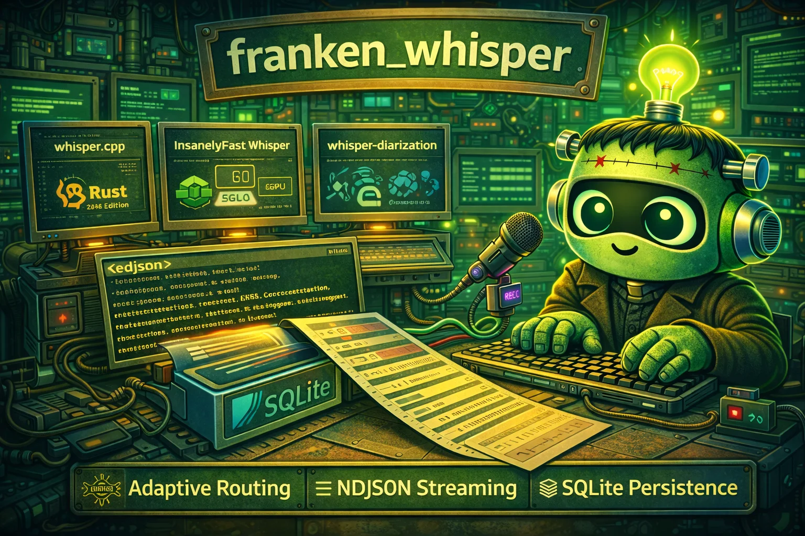

# franken_whisper

<div align="center">
  
</div>

<div align="center">

[](./LICENSE)
[](https://doc.rust-lang.org/edition-guide/rust-2024/)
[](https://github.com/rust-secure-code/safety-dance/)
[](#testing)

</div>

**Agent-first Rust ASR orchestration stack with adaptive backend routing, real-time NDJSON streaming, and SQLite-backed persistence.**

<div align="center">
<h3>Quick Install</h3>

```bash
curl -fsSL "https://raw.githubusercontent.com/Dicklesworthstone/franken_whisper/main/install.sh?$(date +%s)" | bash
```

**Or build from source:**

```bash
git clone https://github.com/Dicklesworthstone/franken_whisper.git
cd franken_whisper && cargo build --release
```

</div>

---

## The Problem

Speech-to-text pipelines are fragmented. You need whisper.cpp for speed, insanely-fast-whisper for GPU batching, and whisper-diarization for speaker identification. Each has its own CLI, output format, error handling, and deployment story. Orchestrating them from scripts means parsing inconsistent stdout, handling timeouts manually, and losing run history.

Agent workflows need structured, streaming, machine-readable output, not human-oriented terminal decorations that break when piped.

## The Solution

franken_whisper is a single Rust binary that wraps all three backends behind a unified interface with:

- **Adaptive backend routing:** Bayesian decision contract selects the best engine per-request with explicit loss matrix, posterior calibration, and deterministic fallback
- **Real-time NDJSON streaming:** every pipeline stage emits sequenced, timestamped events with stable schema (v1.0.0) for agent consumption
- **Durable run history:** every transcription is persisted to SQLite with full event logs, replay envelopes, and JSONL export/import
- **Graceful cancellation:** Ctrl+C propagates through the entire pipeline via cancellation tokens with proper resource cleanup
- **TTY audio transport:** low-bandwidth audio relay over PTY links using mulaw+zlib+base64 NDJSON with handshake, integrity checks, and deterministic retransmission
- **Zero-dependency audio decode:** MP3, AAC, FLAC, WAV, OGG decoded natively via symphonia with no ffmpeg needed for common formats

### Why franken_whisper?

| Feature | whisper.cpp | insanely-fast-whisper | whisper-diarization | **franken_whisper** |
|---------|:-----------:|:---------------------:|:-------------------:|:-------------------:|
| Streaming output | partial | no | no | **NDJSON stage events** |
| Machine-readable errors | no | no | no | **12 structured error codes** |
| Adaptive backend selection | -- | -- | -- | **Bayesian routing** |
| Run persistence | no | no | no | **SQLite + JSONL** |
| Diarization | no | yes (HF token) | yes | **yes (any backend)** |
| GPU acceleration | CUDA/Metal | CUDA/MPS | CUDA | **frankentorch/frankenjax** |
| Cancellation support | SIGKILL | SIGKILL | SIGKILL | **graceful token-based** |
| TTY audio relay | no | no | no | **mulaw+zlib+b64 NDJSON** |
| Native audio decode | WAV only | needs ffmpeg | needs ffmpeg | **MP3/AAC/FLAC/WAV/OGG/ALAC** |
| Memory safety | C++ | Python | Python | **`#![forbid(unsafe_code)]`** |

---

## Quick Example

```bash
# Transcribe any audio file -- MP3/FLAC/OGG/AAC decoded natively, no ffmpeg needed
cargo run -- transcribe --input meeting.mp3 --json

# Transcribe a video file -- audio extracted automatically via ffmpeg fallback
cargo run -- transcribe --input presentation.mp4 --json

# Stream real-time pipeline events (agent mode)
cargo run -- robot run --input meeting.mp3 --backend auto

# Speculative streaming: fast partial results with quality corrections
cargo run -- robot run --input meeting.mp3 --speculative \
  --fast-model tiny.en --quality-model large-v3

# Transcribe with speaker diarization
cargo run -- transcribe --input meeting.mp3 --diarize --hf-token "$HF_TOKEN" --json

# TinyDiarize: whisper.cpp's built-in speaker-turn detection (no HF token needed)
cargo run -- transcribe --input meeting.mp3 --tiny-diarize --json

# Discover available backends and their capabilities
cargo run -- robot backends

# System health check (backends, ffmpeg, database, resources)
cargo run -- robot health

# Query run history
cargo run -- runs --limit 10 --format json

# Export runs to portable JSONL snapshot (full or incremental)
cargo run -- sync export-jsonl --output ./snapshot

# TTY audio: encode, transmit over lossy link, decode
cargo run -- tty-audio encode --input audio.wav > frames.ndjson
cat frames.ndjson | cargo run -- tty-audio decode --output restored.wav
```

---

## Design Philosophy

### Agent-First, Human-Optional

Every command produces structured NDJSON on stdout. Human-friendly output is the exception (plain `transcribe` mode), not the rule. The `robot` subcommand is the primary interface. It emits sequenced stage events with stable schema versioning so upstream agents can parse output without fragile regex.

### Deterministic by Default

Given identical inputs and parameters, franken_whisper produces identical outputs. The retransmit loop, replay envelopes, and conformance harness all enforce determinism. Random elements (UUIDs, timestamps) are isolated to metadata fields, never to computational outputs.

### Fail Loud, Recover Gracefully

Every error has a structured code (`FW-IO`, `FW-CMD-TIMEOUT`, `FW-BACKEND-UNAVAILABLE`, etc.) and propagates through the NDJSON event stream. Cancellation tokens allow in-flight work to checkpoint and clean up rather than being killed mid-write.

### Composition Over Configuration

The 10-stage pipeline (Ingest, Normalize, VAD, Separate, Backend, Accelerate, Align, Punctuate, Diarize, Persist) is composed dynamically per-request. Stages are skipped when unnecessary, budgeted independently, and profiled automatically.

### No Unsafe Code

The entire codebase uses `#![forbid(unsafe_code)]`. Memory safety is enforced at the compiler level, not by convention.

### Zero External Dependencies for Common Audio

franken_whisper can transcribe MP3, AAC, FLAC, WAV, OGG, and other common audio files without ffmpeg, Python, or any other runtime dependency beyond the backend engine itself. The built-in Rust audio decoder (symphonia) handles format detection, codec decoding, sample rate conversion, and channel mixing entirely in-process. ffmpeg is only invoked as a fallback for video files and exotic codecs, and even then it is auto-provisioned if missing.

---

## The Whisper Ecosystem Landscape

The whisper ecosystem has dozens of tools. This diagram shows where franken_whisper fits:

```
          +--------------------------------------------------------------+
          |            INFERENCE ENGINES (run models)                    |
          |                                                              |
          | whisper.cpp (C++, CPU/Metal/CUDA, ~47k stars)                |
          | faster-whisper (Python/CTranslate2, ~14k stars)              |
          | OpenAI Whisper (Python/PyTorch, ~95k stars)                  |
          +--------------------------------------------------------------+
                                         |
          +------------------------------v-------------------------------+
          |     ENHANCED PIPELINES (add features on top)                 |
          |                                                              |
          | WhisperX (faster-whisper + wav2vec2 + pyannote)              |
          | whisper-diarization (Whisper + Demucs + TitaNet)             |
          | insanely-fast-whisper (HF Transformers, max GPU)             |
          | whisper-timestamped (DTW word timestamps)                    |
          +--------------------------------------------------------------+
                                         |
          +------------------------------v-------------------------------+
          | ORCHESTRATION (manage engines/pipelines)                     |
          |                                                              |
          | > franken_whisper < (Rust, Bayesian routing,                 |
          |   10-stage pipeline, speculative streaming,                  |
          |   conformance validation, evidence-based decisions)          |
          +--------------------------------------------------------------+
```

Most tools in the ecosystem occupy one level. franken_whisper occupies the orchestration level: it wraps inference engines and enhanced pipelines behind a unified interface, then adds capabilities that none of them provide individually.

---

## How franken_whisper Compares

### Orchestration & Architecture

| Capability | whisper.cpp | faster-whisper | WhisperX | WhisperLive | WhisperS2T | **franken_whisper** |
|------------|:-----------:|:--------------:|:--------:|:-----------:|:----------:|:-------------------:|
| Language | C++ | Python | Python | Python | Python | **Rust** |
| Multi-backend | -- | -- | -- | 3 backends | 4 backends | **3 backends + 3 native pilots** |
| Backend selection | -- | -- | -- | manual | manual | **Bayesian adaptive routing** |
| Pipeline stages | monolithic | monolithic | 3-stage | monolithic | monolithic | **10 composable stages** |
| Per-stage budgets | -- | -- | -- | -- | -- | **independent timeouts** |
| Speculative streaming | -- | -- | -- | single-model | -- | **dual-model fast+quality** |
| Conformance validation | -- | -- | -- | -- | -- | **cross-engine 50ms tolerance** |
| Native rollout governance | -- | -- | -- | -- | -- | **5-stage shadow->sole** |
| Memory safety | C++ | Python GC | Python GC | Python GC | Python GC | **`#![forbid(unsafe_code)]`** |

### Persistence & Observability

| Capability | whisper.cpp | faster-whisper | WhisperX | WhisperLive | **franken_whisper** |
|------------|:-----------:|:--------------:|:--------:|:-----------:|:-------------------:|
| Run history | none | none | none | none | **SQLite + JSONL export** |
| Decision audit trail | -- | -- | -- | -- | **200-entry evidence ledger** |
| Replay envelopes | -- | -- | -- | -- | **SHA-256 content hashing** |
| Replay packs | -- | -- | -- | -- | **4-artifact reproducibility bundle** |
| Structured errors | exit code | exceptions | exceptions | -- | **12 `FW-*` error codes** |
| NDJSON streaming | partial | -- | -- | WebSocket | **sequenced stage events** |
| Cancellation | SIGKILL | KeyboardInterrupt | -- | -- | **cooperative `CancellationToken`** |
| Resource cleanup | none guaranteed | GC | GC | GC | **RAII + bounded finalizers** |
| Latency profiling | -- | -- | -- | -- | **per-stage with tuning recs** |

### Audio & Format Support

| Capability | whisper.cpp | faster-whisper | WhisperX | **franken_whisper** |
|------------|:-----------:|:--------------:|:--------:|:-------------------:|
| Native audio decode | WAV only | -- (needs ffmpeg) | -- (needs ffmpeg) | **MP3/AAC/FLAC/WAV/OGG/ALAC (symphonia)** |
| ffmpeg required? | for non-WAV | yes | yes | **no (fallback only)** |
| Video audio extraction | -- | -- | -- | **automatic (`-vn` flag)** |
| TTY audio transport | -- | -- | -- | **mulaw+zlib+b64 NDJSON** |
| Microphone capture | -- | -- | -- | **platform-specific ffmpeg** |
| Auto-provision ffmpeg | -- | -- | -- | **downloads static binary if missing** |

### Commercial API Comparison

| Capability | Groq Whisper API | Deepgram Nova-3 | AssemblyAI | **franken_whisper** |
|------------|:----------------:|:---------------:|:----------:|:-------------------:|
| Runs locally | no | no | no | **yes** |
| Open source | no | no | no | **yes (MIT)** |
| Data leaves machine | yes | yes | yes | **never** |
| Cost per hour of audio | ~$0.04 | ~$0.75 | ~$0.65 | **$0 (your hardware)** |
| Inference speed | very fast | fast | moderate | **depends on backend** |
| Multi-model routing | -- | -- | -- | **Bayesian adaptive** |
| Diarization | limited | yes | yes | **yes (any backend)** |
| Custom pipeline stages | -- | -- | -- | **10 composable stages** |

---

## Installation

### Quick Install (Pre-built Binary)

```bash
curl -fsSL "https://raw.githubusercontent.com/Dicklesworthstone/franken_whisper/main/install.sh?$(date +%s)" | bash
```

Options: `--system` (install to `/usr/local/bin`), `--easy-mode` (auto-update PATH), `--verify` (self-test), `--version vX.Y.Z`, `--uninstall`.

### From Source

```bash
git clone https://github.com/Dicklesworthstone/franken_whisper.git
cd franken_whisper

# minimal build
cargo build --release

# with TUI support
cargo build --release --features tui

# with GPU acceleration
cargo build --release --features gpu-frankentorch
cargo build --release --features gpu-frankenjax
```

The release profile is optimized for size (`opt-level = "z"`, LTO, single codegen unit, stripped symbols).

### Prerequisites

- **Rust nightly** (2024 edition)
- **ffmpeg** (optional): only needed for video files, exotic audio codecs symphonia cannot decode, and live microphone capture; the built-in Rust audio decoder handles MP3, AAC, FLAC, WAV, OGG, and other common formats natively with zero external dependencies
- **Backend binaries** (at least one):
  - `whisper-cli` (from whisper.cpp); override: `FRANKEN_WHISPER_WHISPER_CPP_BIN`
  - `insanely-fast-whisper` (Python); override: `FRANKEN_WHISPER_INSANELY_FAST_BIN`
  - `python3` with `pyannote.audio` (for diarization backend); override: `FRANKEN_WHISPER_PYTHON_BIN`
- **HuggingFace token** (for diarization): `--hf-token` or `FRANKEN_WHISPER_HF_TOKEN` / `HF_TOKEN`

### Path Dependencies

franken_whisper depends on sibling projects via Cargo path dependencies:

```
../frankensqlite       # SQLite persistence (fsqlite crate)
../frankentui          # TUI (optional, feature: tui)
../frankentorch        # GPU acceleration (optional, feature: gpu-frankentorch)
../frankenjax          # GPU acceleration (optional, feature: gpu-frankenjax)
```

---

## Quick Start

### 1. Basic Transcription

```bash
# plain text output
cargo run -- transcribe --input audio.mp3

# full JSON report (includes segments, timing, backend info)
cargo run -- transcribe --input audio.mp3 --json

# specific backend
cargo run -- transcribe --input audio.mp3 --backend whisper_cpp --json

# with language hint
cargo run -- transcribe --input audio.mp3 --language ja --json
```

### 2. Robot Mode (Agent Integration)

```bash
# real-time NDJSON event stream
cargo run -- robot run --input audio.mp3 --backend auto
```

Output (one JSON object per line):
```json
{"event":"run_start","schema_version":"1.0.0","request":{"input":"audio.mp3","backend":"auto"}}
{"event":"stage","schema_version":"1.0.0","run_id":"...","seq":1,"stage":"ingest","code":"ingest.start","message":"materializing input"}
{"event":"stage","schema_version":"1.0.0","run_id":"...","seq":2,"stage":"normalize","code":"normalize.ok","message":"audio normalized"}
{"event":"run_complete","schema_version":"1.0.0","run_id":"...","backend":"whisper_cpp","transcript":"Hello world..."}
```

### 3. Speaker Diarization

```bash
cargo run -- transcribe \
  --input meeting.mp3 \
  --diarize \
  --hf-token "$HF_TOKEN" \
  --min-speakers 2 \
  --max-speakers 5 \
  --json
```

### 4. Microphone Capture

```bash
# record 30 seconds from default mic
cargo run -- transcribe --mic --mic-seconds 30 --json

# specific device
cargo run -- transcribe --mic --mic-device "hw:0" --json
```

### 5. Stdin Input

```bash
# pipe audio bytes
cat audio.mp3 | cargo run -- transcribe --stdin --json
```

---

## Command Reference

### `transcribe`

Core transcription command. Runs the full pipeline: ingest, normalize, backend execution, optional acceleration, and persistence.

```bash
cargo run -- transcribe [OPTIONS]
```

**Input (mutually exclusive):**

| Flag | Description |
|------|-------------|
| `--input <PATH>` | Audio/video file path |
| `--stdin` | Read audio bytes from stdin |
| `--mic` | Capture from microphone via ffmpeg |

**Backend & Model:**

| Flag | Default | Description |
|------|---------|-------------|
| `--backend <KIND>` | `auto` | `auto`, `whisper_cpp`, `insanely_fast`, `whisper_diarization` |
| `--model <MODEL>` | backend-specific | Model name/path forwarded to backend |
| `--language <LANG>` | auto-detect | Language hint (ISO 639-1) |
| `--translate` | false | Translate to English |
| `--diarize` | false | Enable speaker diarization |

**Output:**

| Flag | Description |
|------|-------------|
| `--json` | Full JSON run report |
| `--output-txt` | Plain text (whisper.cpp) |
| `--output-vtt` | WebVTT subtitles |
| `--output-srt` | SRT subtitles |
| `--output-csv` | CSV |
| `--output-json-full` | Extended JSON with metadata |
| `--output-lrc` | LRC karaoke format |

**Storage:**

| Flag | Default | Description |
|------|---------|-------------|
| `--db <PATH>` | `.franken_whisper/storage.sqlite3` | SQLite database path |
| `--no-persist` | false | Skip persistence |

**Inference Tuning (whisper.cpp):**

| Flag | Default | Description |
|------|---------|-------------|
| `--threads <N>` | 4 | Computation threads |
| `--processors <N>` | 1 | Parallel processors |
| `--no-gpu` | false | Force CPU-only |
| `--beam-size <N>` | 5 | Beam search width |
| `--best-of <N>` | 5 | Sampling candidates |
| `--temperature <F>` | 0.0 | Sampling temperature |
| `--temperature-increment <F>` | -- | Temperature fallback increment |
| `--entropy-threshold <F>` | -- | Entropy threshold for fallback |
| `--logprob-threshold <F>` | -- | Log probability threshold |
| `--no-speech-threshold <F>` | -- | No-speech probability threshold |
| `--max-context <N>` | -- | Maximum context tokens from prior segment |
| `--max-segment-length <N>` | -- | Maximum segment length in characters |
| `--no-timestamps` | false | Suppress timestamps |
| `--detect-language-only` | false | Detect language and exit (no transcription) |
| `--split-on-word` | false | Split segments on word boundaries |
| `--no-fallback` | false | Disable temperature fallback |
| `--suppress-nst` | false | Suppress non-speech tokens |
| `--tiny-diarize` | false | Enable TinyDiarize (speaker-turn token injection) |
| `--prompt <TEXT>` | -- | Initial prompt to guide transcription style |
| `--carry-initial-prompt` | false | Carry prompt across segments |

**Audio Windowing (whisper.cpp):**

| Flag | Default | Description |
|------|---------|-------------|
| `--offset-ms <N>` | 0 | Start transcription at offset (ms) |
| `--duration-ms <N>` | -- | Transcribe only this duration (ms) |
| `--audio-ctx <N>` | -- | Audio context size (tokens) |
| `--word-threshold <F>` | -- | Word-level timestamp confidence threshold |
| `--suppress-regex <REGEX>` | -- | Suppress tokens matching regex |

**VAD (Voice Activity Detection):**

| Flag | Default | Description |
|------|---------|-------------|
| `--vad` | false | Enable Voice Activity Detection |
| `--vad-model <PATH>` | -- | Custom VAD model path |
| `--vad-threshold <F>` | -- | Speech detection threshold |
| `--vad-min-speech-ms <N>` | -- | Minimum speech duration (ms) |
| `--vad-min-silence-ms <N>` | -- | Minimum silence duration (ms) |
| `--vad-max-speech-s <F>` | -- | Maximum speech duration (seconds) |
| `--vad-speech-pad-ms <N>` | -- | Speech padding (ms) |
| `--vad-samples-overlap <N>` | -- | Sample overlap between windows |

**Batching (insanely-fast-whisper):**

| Flag | Default | Description |
|------|---------|-------------|
| `--batch-size <N>` | 24 | Parallel inference batch size |
| `--gpu-device <DEV>` | auto | GPU device (`0`, `cuda:0`, `mps`) |
| `--flash-attention` | false | Enable Flash Attention 2 |
| `--hf-token <TOKEN>` | env | HuggingFace token for diarization |
| `--timestamp-level` | `chunk` | `chunk` or `word` granularity |
| `--transcript-path <PATH>` | -- | Override transcript output path |

**Diarization:**

| Flag | Description |
|------|-------------|
| `--num-speakers <N>` | Exact speaker count |
| `--min-speakers <N>` | Minimum speakers |
| `--max-speakers <N>` | Maximum speakers |
| `--no-stem` | Disable vocal isolation (Demucs source separation) |
| `--suppress-numerals` | Spell out numbers for alignment stability |
| `--diarization-model <MODEL>` | Override whisper model for diarization stage |

**Speculative Streaming:**

| Flag | Default | Description |
|------|---------|-------------|
| `--speculative` | false | Enable dual-model speculative cancel-correct mode |
| `--fast-model <MODEL>` | -- | Fast model for low-latency partial transcripts |
| `--quality-model <MODEL>` | -- | Quality model for correction/verification |
| `--speculative-window-ms <N>` | 3000 | Sliding window size (ms) |
| `--speculative-overlap-ms <N>` | 500 | Window overlap (ms) |
| `--correction-tolerance-wer <F>` | -- | WER tolerance for confirmation vs. retraction |
| `--no-adaptive` | false | Disable adaptive window sizing |
| `--always-correct` | false | Force quality model on every window (evaluation mode) |

### `robot`

Agent-first interface with structured NDJSON output.

```bash
# streaming transcription with stage events
cargo run -- robot run [TRANSCRIBE_OPTIONS]

# emit JSON schema for all event types
cargo run -- robot schema

# discover backends and capabilities
cargo run -- robot backends

# system health diagnostics (backends, ffmpeg, database, resources)
cargo run -- robot health

# query routing decision history
cargo run -- robot routing-history [--run-id <ID>] [--limit 20]
```

**Robot Event Types (12 total):**

| Event | Description |
|-------|-------------|
| `run_start` | Request accepted, pipeline starting |
| `stage` | Pipeline stage progress (sequenced, timestamped) |
| `run_complete` | Transcription finished with full result |
| `run_error` | Pipeline failed with structured error code |
| `backends.discovery` | Backend discovery response with per-backend capabilities |
| `routing_decision` | Backend routing decision with posterior snapshot and evidence |
| `health.report` | System health diagnostics (backend/ffmpeg/DB/resource status) |
| `transcript.partial` | Speculative fast-model partial transcript (immediate) |
| `transcript.confirm` | Quality model confirms partial (drift within tolerance) |
| `transcript.retract` | Quality model retracts partial (drift exceeds tolerance) |
| `transcript.correct` | Quality model correction with corrected segments |
| `transcript.speculation_stats` | Aggregate speculation pipeline statistics |

**Stage Codes:**

Stages emit paired `*.start` / `*.ok` codes (or `*.error` on failure, `*.skip` when not needed):

`ingest.start`, `ingest.ok`, `normalize.start`, `normalize.ok`, `vad.start`, `vad.ok`, `separate.start`, `separate.ok`, `backend.start`, `backend.ok`, `backend.routing.decision_contract`, `accelerate.start`, `accelerate.ok`, `align.start`, `align.ok`, `punctuate.start`, `punctuate.ok`, `diarize.start`, `diarize.ok`, `persist.start`, `persist.ok`, `orchestration.latency_profile`

**Health Report:** The `robot health` command probes all subsystems and returns a structured diagnostic:

```json
{
  "event": "health.report",
  "schema_version": "1.0.0",
  "ts": "2026-02-22T00:00:00Z",
  "backends": [{"name": "whisper.cpp", "available": true, "path": null, "version": "1.7.2", "issues": []}],
  "ffmpeg": {"name": "ffmpeg", "available": true, "path": "/usr/bin/ffmpeg", "version": null, "issues": []},
  "database": {"name": "database", "available": true, "path": ".franken_whisper/storage.sqlite3", "version": null, "issues": []},
  "resources": {"disk_free_bytes": 12345, "disk_total_bytes": 67890, "memory_available_bytes": 11111, "memory_total_bytes": 22222},
  "overall_status": "ok"
}
```

### `runs`

Query persisted run history.

```bash
cargo run -- runs [--limit 20] [--format plain|json|ndjson] [--id <RUN_ID>]
```

| Flag | Default | Description |
|------|---------|-------------|
| `--limit <N>` | 20 | Max recent runs |
| `--format` | `plain` | `plain` (table), `json` (pretty), `ndjson` (streaming) |
| `--id <UUID>` | -- | Fetch specific run details |

### `sync`

One-way JSONL snapshot export/import.

```bash
# export
cargo run -- sync export-jsonl --output ./snapshot [--db <PATH>]

# import
cargo run -- sync import-jsonl --input ./snapshot --conflict-policy reject|skip|overwrite|overwrite-strict
```

Export produces: `runs.jsonl`, `segments.jsonl`, `events.jsonl`, `manifest.json` (with SHA-256 checksums).

### `tty-audio`

Low-bandwidth audio transport over TTY/PTY links using the `mulaw+zlib+b64` NDJSON protocol.

```bash
# encode audio to NDJSON frames
cargo run -- tty-audio encode --input audio.wav [--chunk-ms 200]

# decode NDJSON frames to WAV
cat frames.ndjson | cargo run -- tty-audio decode --output restored.wav [--recovery fail_closed|skip_missing]

# generate retransmit plan from lossy stream
cat frames.ndjson | cargo run -- tty-audio retransmit-plan

# emit individual control frames
cargo run -- tty-audio control handshake
cargo run -- tty-audio control ack --up-to-seq 42
cargo run -- tty-audio control backpressure --remaining-capacity 64
cargo run -- tty-audio control retransmit-request --sequences 1,2,4
cargo run -- tty-audio control retransmit-response --sequences 1,2,4

# automated retransmit loop with strategy escalation
cat frames.ndjson | cargo run -- tty-audio control retransmit-loop --rounds 3

# convenience shorthands
cargo run -- tty-audio send-control handshake|eof|reset
cat frames.ndjson | cargo run -- tty-audio retransmit --rounds 3
```

**Recovery Strategies:**

The retransmit loop escalates recovery effort across rounds:

```
Simple (1 frame/round) -> Redundant (2 frames/round) -> Escalate (4 frames/round)
```

**Integrity Checks:**

Each frame carries optional CRC32 and SHA-256 hashes of raw (pre-compression) audio bytes. Mismatches cause frame drops (skip_missing) or stream failure (fail_closed).

See [`docs/tty-audio-protocol.md`](docs/tty-audio-protocol.md) for the full protocol specification.

### `tui`

Interactive TUI for human operators (feature-gated, requires `--features tui`).

```bash
cargo run --features tui -- tui
```

**Features:**

- **Live transcription view:** Real-time segment display with auto-scroll behavior
- **Speaker labels and timestamps:** Each segment displays start/end times, speaker identification, and confidence scores
- **Runs list:** Browse persisted run history with timing and backend info
- **Timeline view:** Visual timeline of pipeline stages with duration bars
- **Event detail panes:** Inspect individual NDJSON events with full payload
- **Segment retention:** Caps display at 10,000 segments with oldest-first drain
- **Keyboard navigation:** Focus cycling between panes, vim-style keybindings

Built on the [FrankenTUI](https://github.com/Dicklesworthstone/frankentui) framework.

---

## Configuration

### Environment Variables

| Variable | Default | Description |
|----------|---------|-------------|
| `FRANKEN_WHISPER_WHISPER_CPP_BIN` | `whisper-cli` | whisper.cpp binary name/path |
| `FRANKEN_WHISPER_INSANELY_FAST_BIN` | `insanely-fast-whisper` | insanely-fast-whisper binary |
| `FRANKEN_WHISPER_PYTHON_BIN` | `python3` | Python interpreter for diarization |
| `FRANKEN_WHISPER_HF_TOKEN` | -- | HuggingFace token (preferred over `HF_TOKEN`) |
| `HF_TOKEN` | -- | HuggingFace token (fallback) |
| `FRANKEN_WHISPER_DIARIZATION_DEVICE` | -- | GPU device for diarization backend |
| `FRANKEN_WHISPER_STATE_DIR` | `.franken_whisper` | State directory root |
| `FRANKEN_WHISPER_DB` | `.franken_whisper/storage.sqlite3` | SQLite database path |
| `FRANKEN_WHISPER_FFMPEG_BIN` | auto | Explicit ffmpeg binary path override |
| `FRANKEN_WHISPER_FFPROBE_BIN` | auto | Explicit ffprobe binary path override |
| `FRANKEN_WHISPER_AUTO_PROVISION_FFMPEG` | `1` | Auto-provision local ffmpeg/ffprobe bundle when system binaries are missing (`0`/`false` disables) |
| `FRANKEN_WHISPER_FORCE_FFMPEG_NORMALIZE` | `0` | Force file normalization through ffmpeg even when the built-in Rust decoder can handle the format (`1`/`true` enables) |
| `FRANKEN_WHISPER_NATIVE_EXECUTION` | `0` | Enable native in-process engine dispatch (`1`/`true`) |
| `FRANKEN_WHISPER_BRIDGE_NATIVE_RECOVERY` | `1` | In bridge-only mode, allow recoverable bridge failures to fall back to native engines (`0`/`false` disables) |
| `FRANKEN_WHISPER_NATIVE_ROLLOUT_STAGE` | `primary` | Native engine rollout stage |
| `RUST_LOG` | -- | tracing filter (e.g. `franken_whisper=debug`) |

### Cargo Features

| Feature | Description |
|---------|-------------|
| `tui` | Enable interactive TUI via frankentui |
| `gpu-frankentorch` | Enable frankentorch GPU acceleration |
| `gpu-frankenjax` | Enable frankenjax GPU acceleration |

No features are enabled by default.

### Backend Routing

The `auto` backend uses adaptive Bayesian routing:

**Non-diarization priority:** `whisper_cpp` > `insanely_fast` > `whisper_diarization`

**Diarization priority:** `insanely_fast` > `whisper_diarization` > `whisper_cpp`

Each `auto` run emits a `backend.routing.decision_contract` stage event with explicit state/action/loss/posterior/calibration terms. The router falls back to deterministic static priority when calibration score drops below 0.3 or Brier score exceeds 0.35.

### Native Engine Rollout

Native Rust engine replacements follow a staged rollout:

| Stage | Behavior |
|-------|----------|
| `shadow` | Deterministic bridge execution only; native conformance validated out-of-band |
| `validated` | Deterministic bridge execution only with stricter conformance gating |
| `fallback` | Deterministic bridge execution only; fallback policy and evidence paths hardened |
| `primary` | Native preferred with deterministic bridge fallback (requires `FRANKEN_WHISPER_NATIVE_EXECUTION=1`) |
| `sole` | Native only (requires `FRANKEN_WHISPER_NATIVE_EXECUTION=1`) |

---

## Architecture

```
                  +------------------------------------+
                  |       CLI / Robot                  |
                  |   (clap + NDJSON emit)             |
                  +------------------------------------+
                                    |
                  +-----------------v------------------+
                  |   FrankenWhisperEngine             |
                  |     (orchestrator.rs)              |
                  |                                    |
                  |   10-Stage Pipeline:               |
                  |    1. Ingest                       |
                  |    2. Normalize                    |
                  |    3. VAD                          |
                  |    4. Source Separate              |
                  |    5. Backend Execution            |
                  |    6. Accelerate (GPU)             |
                  |    7. Alignment                    |
                  |    8. Punctuation                  |
                  |    9. Diarization                  |
                  |   10. Persist                      |
                  +------------------------------------+
                         |       |       |
    +------------------+  +----------+  +------------------+
    | Backends         |  | Accel    |  | Storage          |
    |                  |  |          |  |                  |
    | whisper.cpp      |  | frank    |  | fsqlite          |
    | insanely-fast    |  | torch    |  | (SQLite WAL)     |
    | whisper-diar     |  | frank    |  |                  |
    | native pilots    |  |  jax     |  | JSONL export     |
    +------------------+  +----------+  +------------------+

  +------------------+   +------------------+   +------------------+
  | TTY Audio        |   | Conformance      |   | Replay           |
  |                  |   |                  |   |                  |
  | mulaw+zlib+b64   |   | 50ms tolerance   |   | SHA-256 content  |
  | NDJSON transport |   | cross-engine     |   | hash envelopes   |
  | handshake/retry  |   | comparator       |   | drift detection  |
  +------------------+   +------------------+   +------------------+
```

### Data Flow

1. **Ingest:** Materialize input from file, stdin, or microphone capture
2. **Normalize:** Convert to 16kHz mono WAV via built-in Rust decoder (ffmpeg fallback for video/exotic formats)
3. **VAD:** (Optional) Voice Activity Detection to skip silence
4. **Source Separate:** (Optional) Vocal isolation for cleaner transcription
5. **Backend:** Dispatch to selected engine (adaptive routing or explicit)
6. **Accelerate:** (Optional) GPU confidence normalization via frankentorch/frankenjax
7. **Alignment:** (Optional) Forced alignment for word-level timestamps
8. **Punctuation:** (Optional) Punctuation restoration
9. **Diarization:** (Optional) Speaker identification and labeling
10. **Persist:** Write run report, segments, and events to SQLite

Each stage emits `*.start` and `*.ok` events to the NDJSON stream with timing, sequence numbers, and structured payloads.

---

## Technical Details

### Bayesian Backend Router

When `--backend auto` is selected, franken_whisper uses a formal Bayesian decision contract to choose the best engine for each request rather than trying backends in a fixed order.

**State Space (3 states):**
- `all_available`: all three backends found on PATH and responsive
- `partial_available`: 1-2 backends operational
- `none_available`: nothing usable

**Action Space (4 actions):**
- `try_whisper_cpp`, `try_insanely_fast`, `try_diarization` (reordered per-request based on `--diarize`)
- `fallback_error`: return structured error when nothing is available

**Loss Matrix:**

The router maintains a 3x4 loss matrix (states x actions). Each cell contains an expected cost computed from three weighted factors:

```
cost = (0.45 x latency_cost) + (0.35 x quality_cost) + (0.20 x failure_cost)
```

- **Latency cost** scales with audio duration (short/medium/long buckets) and backend latency proxy
- **Quality cost** depends on backend capability relative to the request (diarization support, GPU availability)
- **Failure cost** is `(1.0 - p_success) x 100`, where `p_success` comes from the Bayesian posterior

**Bayesian Posterior:**

Each backend starts with a Beta distribution prior reflecting expected reliability:

| Backend | Prior | Interpretation |
|---------|-------|----------------|
| whisper_cpp | Beta(7, 3) | Strong expectation of success |
| insanely_fast | Beta(6, 4) | Moderate expectation |
| whisper_diarization | Beta(5, 5) | Weakest prior (most uncertain) |

After each run, the posterior is updated with the observed outcome.

**Calibration & Fallback:**

The router tracks a sliding window of 50 prediction-outcome pairs and computes a Brier score. The adaptive router falls back to deterministic static priority when any of these hold:
- Fewer than 5 observations (insufficient data)
- Calibration score < 0.3 (posterior margin too narrow)
- Brier score > 0.35 (predictions don't match reality)

**Latency Proxy Model:**

Backend latency is estimated as a function of audio duration with per-backend parameters:

```
latency_cost = base + (sqrt(audio_duration_seconds) * multiplier)
```

| Backend | Base Cost | Multiplier (normal) | Multiplier (diarize) |
|---------|-----------|---------------------|----------------------|
| whisper_cpp | 18.0 | 1.0 | 1.25 |
| insanely_fast | 8.0 | 1.0 | 1.25 |
| whisper_diarization | 18.0 | 1.0 | 1.25 |

When empirical latency data is available (>= 5 observations), the estimate blends prior and empirical: `(0.6 * prior_latency) + (0.4 * empirical_latency)`.

**Quality Proxy Model:**

Each backend has a quality score that varies based on whether diarization is requested:

| Backend | Quality (normal) | Quality (diarize) |
|---------|-----------------|-------------------|
| whisper_cpp | 0.84 | 0.55 |
| insanely_fast | 0.80 | 0.65 |
| whisper_diarization | 0.60 | 0.60 |

The quality score feeds into the posterior success probability: `p_success = (alpha + quality_score * 2.0 + diarize_boost) / (alpha + beta + quality_terms + penalty_terms)`.

**Availability Penalties:**

The loss matrix applies sharp penalties when backends are unavailable:

| State | Penalty |
|-------|---------|
| Available | +0 |
| Partially available | +333 |
| Unavailable | +1,000 |

These penalties dominate the loss calculation, ensuring the router never selects an unavailable backend even if its quality/latency profile is otherwise attractive.

**Policy Versioning:**

The routing policy is versioned (`backend-selection-v1.0`). The `loss_matrix_hash` field in evidence entries enables detecting when the policy weights changed between runs, supporting reproducibility audits.

**Evidence Ledger:**

Every routing decision is recorded in a circular buffer (capacity: 200 entries) containing the decision ID, trace ID, observed state, chosen action, posterior snapshot, calibration metrics, and whether fallback was triggered.

### Pipeline Stage Budgets

Each pipeline stage runs under an independent millisecond budget. Default budgets:

| Stage | Budget | Rationale |
|-------|--------|-----------|
| Ingest | 15s | File I/O or mic capture |
| Normalize | 180s | Audio decode + resample |
| VAD | 10s | Lightweight energy detection |
| Source Separate | 30s | Demucs-style vocal isolation |
| Backend | 900s (15 min) | Full inference (long audio on CPU) |
| Accelerate | 20s | GPU confidence normalization |
| Align | 30s | CTC forced alignment |
| Punctuate | 10s | Punctuation model inference |
| Diarize | 30s | Speaker clustering |
| Persist | 20s | SQLite transaction |
| Cleanup | 5s | Finalizer timeout |

Every budget is overridable via `FRANKEN_WHISPER_STAGE_BUDGET_<STAGE>_MS` environment variables.

**Automatic Latency Profiling:**

After each run, the orchestrator emits an `orchestration.latency_profile` stage event with per-stage timing decomposition. The profiler computes a utilization ratio (`service_ms / budget_ms`) and emits tuning recommendations:

| Utilization | Recommendation |
|-------------|----------------|
| <= 30% | `decrease_budget_candidate` |
| 30-90% | `keep_budget` |
| >= 90% | `increase_budget` (suggest 1.25x current) |

### Replay Envelopes & Drift Detection

Every completed run produces a `ReplayEnvelope` containing SHA-256 hashes:

```
+-------------------------------------------------+
|               ReplayEnvelope                    |
+-------------------------------------------------+
| input_content_hash:  SHA-256(normalized WAV)    |
| backend_identity:    "whisper-cli-v1.7.2"       |
| backend_version:     "1.7.2"                    |
| output_payload_hash: SHA-256(raw backend JSON)  |
+-------------------------------------------------+
```

Given identical input audio and the same backend version, the output hash should be identical. If it changes between runs, something drifted.

### Replay Packs

Self-contained **replay packs** capture everything needed to reproduce and analyze a run:

```
replay_pack/
  env.json                # EnvSnapshot: OS, arch, backend identity/version, fw version
  manifest.json           # PackManifest: trace_id, run_id, timestamps, content hashes
  repro.lock              # ReproLock: routing evidence, replay envelope, request params
  tolerance_manifest.json # ToleranceManifest: schema version, timestamp tolerance
```

**Replay Pack Artifact Details:**

| File | Struct | Contents |
|------|--------|----------|
| `env.json` | `EnvSnapshot` | OS, architecture, backend identity/version, franken_whisper version (compile-time `CARGO_PKG_VERSION`) |
| `manifest.json` | `PackManifest` | trace_id, run_id, start/finish timestamps, input/output SHA-256 hashes, segment/event/evidence counts |
| `repro.lock` | `ReproLock` | Routing evidence chain, frozen replay envelope, original backend request, diarize flag |
| `tolerance_manifest.json` | `ToleranceManifest` | Schema version (`tolerance-manifest-v1`), timestamp tolerance in seconds, text/speaker exactness flags, native rollout stage, segment/event counts |

All four files are **deterministic**: the same input `RunReport` produces byte-identical output across runs and machines. This property is critical for regression detection: if the same audio produces different replay packs on different runs, something in the pipeline changed.

### Conformance Harness

The conformance module enforces cross-engine compatibility using a 50ms canonical timestamp tolerance. Segment comparison counts violations:

| Violation Type | Condition |
|----------------|-----------|
| Text mismatch | Segment text differs at same index |
| Speaker mismatch | Speaker label differs (optional check) |
| Timestamp violation | start/end differs by > 50ms |
| Length mismatch | Different segment counts |

Includes overlap detection, WER approximation (Levenshtein-based), and segment invariant validation (finite timestamps, non-negative values, confidence in [0.0, 1.0], non-empty text).

### Speculative Streaming Architecture

Dual-model streaming pattern for real-time transcription with quality corrections:

```
Audio Stream
  |
  +---> WindowManager (sliding windows with overlap)
  |       |
  |       +---> Fast Model ---> PartialTranscript (status: Pending)
  |       |                        |
  |       |                        v emit "transcript.partial" event
  |       |
  |       +---> Quality Model ---> CorrectionDrift analysis
  |                                  |
  |                                  +- drift below tolerance ---> "transcript.confirm"
  |                                  +- drift above tolerance ---> "transcript.retract" + corrected text
  |
  +---> CorrectionTracker (adaptive thresholds)
```

The `CorrectionTracker` maintains running drift statistics and adaptively adjusts confirmation thresholds.

### Audio Normalization Pipeline

Input audio is normalized to 16 kHz, mono, 16-bit PCM WAV:

```
Input file (any format)
  |
  +-> Built-in Rust decoder (PRIMARY)
  |     symphonia: MP3, AAC, FLAC, WAV, OGG, Vorbis, ALAC, PCM variants
  |     Resampler: linear interpolation to 16 kHz
  |     Channel mixer: stereo/surround -> mono via sample averaging
  |     Output: normalized_16k_mono.wav (PCM S16LE)
  |
  +-> ffmpeg subprocess (FALLBACK -- only if built-in decoder fails)
        Triggered for: video files, exotic codecs (AC3, DTS, Opus-in-MKV, etc.)
        Args: -hide_banner -loglevel error -y -i <input> -vn -ar 16000 -ac 1 -c:a pcm_s16le <output>
```

**ffmpeg fallback chain:**

1. Explicit binary path (`FRANKEN_WHISPER_FFMPEG_BIN`)
2. System-installed `ffmpeg` on PATH
3. Auto-provisioned local binary (linux/x86_64)
4. If all fail: `FW-CMD-MISSING` error with actionable message

Set `FRANKEN_WHISPER_FORCE_FFMPEG_NORMALIZE=1` to bypass the built-in decoder and always use ffmpeg.

### Storage Internals

The storage layer uses `fsqlite` (from the frankensqlite project) with three tables:

```sql
runs     (run_id PK, started_at, finished_at, backend, input_path,
          request_json, result_json, transcript, replay_json, ...)

segments (run_id FK, idx, start_sec, end_sec, speaker, text, confidence)

events   (run_id FK, seq, ts_rfc3339, stage, code, message, payload_json)
```

**Atomic Persistence with Retry:** All inserts are wrapped in a single transaction with 8 retry attempts and exponential backoff (5ms base). Cancellation token is checked before each COMMIT.

**Cancellation-Safe Writes:**

The token checkpoint pattern ensures no partial data reaches the database:

```
SAVEPOINT sp_persist_N
  INSERT INTO runs ...
  INSERT INTO segments ... (N rows)
  INSERT INTO events ... (M rows)
  token.checkpoint()?  <-- rolls back if cancelled
RELEASE SAVEPOINT sp_persist_N
```

If the token fires between inserts, the savepoint rolls back cleanly. If the process is killed during RELEASE, SQLite's journal recovery handles it on next open. The storage layer uses savepoints (not top-level transactions) so that concurrent sessions can nest persist calls without deadlocking.

**Schema Migrations:**

When opening older databases missing expected columns (e.g., `runs.replay_json`, `runs.acceleration_json`), the storage layer performs a safe migration:

1. Switch journal mode from WAL to DELETE (more reliable for DDL)
2. Execute `ALTER TABLE ... ADD COLUMN`
3. Restore WAL mode
4. If migration fails: log the error, leave the database untouched

For severely corrupted databases, the recovery path is JSONL-based: export from a known-good source, create a fresh database, import via `sync import-jsonl`.

### Backend Bridge Adapters

Each backend has a bridge adapter that spawns an external process and parses its output. The adapters normalize diverse output formats into a uniform `TranscriptionResult`.

**whisper.cpp Bridge (`whisper_cpp.rs`):**

Spawns `whisper-cli` (or `FRANKEN_WHISPER_WHISPER_CPP_BIN`) with the audio file and requested parameters. Parses the JSON output file looking for:

```json
{
  "text": "full transcript...",
  "language": "en",
  "segments": [
    {
      "start": 0.0,
      "end": 2.5,
      "text": "Hello world",
      "confidence": 0.95
    }
  ]
}
```

The parser handles multiple JSON layouts: `"transcription"`, `"segments"`, or `"chunks"` arrays. For word-level timestamps, it extracts from nested `"words"` arrays within each segment.

**insanely-fast-whisper Bridge (`insanely_fast.rs`):**

Spawns `insanely-fast-whisper` (or `FRANKEN_WHISPER_INSANELY_FAST_BIN`). Shares the same JSON segment extraction logic as whisper.cpp since both produce compatible output. Falls back to joining segment texts if the root `"text"` key is missing.

**whisper-diarization Bridge (`whisper_diarization.rs`):**

Spawns a Python script via `python3` (or `FRANKEN_WHISPER_PYTHON_BIN`). Parses two output files:

- **`.txt` file**: Full transcript text
- **`.srt` file**: SRT subtitle format with speaker labels

The SRT parser handles timing in both comma (`00:01:23,456`) and dot (`00:01:23.456`) separator formats. Speaker labels are extracted from patterns like `[SPEAKER_00]`, `SPEAKER_00: text`, `spk0: text`, or `s0: text`.

### Run Report Structure

Every transcription produces a `RunReport`, the complete record of what happened:

```
RunReport
  run_id:              "fw-run-abc123"
  trace_id:            "1710000000000-random64"
  started_at_rfc3339:  "2026-03-17T06:00:00Z"
  finished_at_rfc3339: "2026-03-17T06:00:05Z"
  input_path:          "/path/to/audio.mp3"
  normalized_wav_path: "/tmp/normalized_16k_mono.wav"
  request:             TranscribeRequest { ... }      -- full input parameters
  result:              TranscriptionResult { ... }     -- backend output
    transcript:        "Hello world..."
    segments:          [TranscriptionSegment { ... }]  -- timed chunks
    language:          Some("en")
    acceleration:      AccelerationReport { ... }      -- confidence normalization metadata
  events:              [RunEvent { ... }]              -- pipeline stage events (sequenced)
  warnings:            ["..."]                         -- non-fatal issues
  evidence:            [Value { ... }]                 -- routing decision evidence
  replay:              ReplayEnvelope { ... }          -- SHA-256 hashes for deterministic replay
```

The report is both persisted to SQLite (split across `runs`, `segments`, and `events` tables) and optionally emitted as JSON via `--json` or as streaming NDJSON events in robot mode.

### Robot Event Streaming Architecture

In robot mode (`robot run`), the pipeline emits events in real time via an `mpsc` channel:

```
                  +-------------------+
                  |  CLI (main.rs)    |
                  |                   |
                  |  event_rx poll    |<--+
                  |  (every 40ms)     |   |
                  +-------------------+   |
                         |                |  mpsc channel
                         v                |
                  +-------------------+   |
                  |  stdout (NDJSON)  |   |  StreamedRunEvent { run_id, event }
                  |  one line per     |   |
                  |  event            |   |
                  +-------------------+   |
                                          |
                  +-------------------+   |
                  |  Pipeline Worker  |---+
                  |  (background      |
                  |   thread)         |
                  +-------------------+
```

The CLI thread polls the receive end of the channel every 40ms, formatting each event as a single NDJSON line on stdout. The pipeline worker thread runs `transcribe_with_stream()` which emits `StreamedRunEvent` wrappers containing `(run_id, RunEvent)` pairs. When the worker completes, the CLI emits a final `run_complete` or `run_error` event.

**Schema Contract Guarantees:**

| Guarantee | Enforcement |
|-----------|-------------|
| `event` and `schema_version` present on every event | Hardcoded in all `emit_*` functions |
| `seq` strictly increasing per run | Auto-incremented from `events.len()` |
| `ts` non-decreasing per run | Generated from `Utc::now().to_rfc3339()` |
| `run_complete` is always the final event | Emitted only after pipeline returns |
| Stage events follow pipeline order | Orchestrator executes stages sequentially |

### TTY Handshake Protocol

The TTY audio protocol begins with a version and codec negotiation before any audio frames flow:

```
Encoder                                         Decoder
   |                                               |
   |-- Handshake {                                 |
   |     min_version: 1,                           |
   |     max_version: 2,                           |
   |     supported_codecs: ["mulaw+zlib+b64"]      |
   |   } -------------------------------------->   |
   |                                               |
   |   <---------------------------------------    |
   |       HandshakeAck {                          |
   |         negotiated_version: 1,                |
   |         negotiated_codec: "mulaw+zlib+b64"    |
   |       }                                       |
   |                                               |
   |-- AudioFrame { seq: 0, ... } ------------>    |
   |-- AudioFrame { seq: 1, ... } ------------>    |
   |           ...                                 |
   |-- SessionClose { last_data_seq: N } ----->    |
   |                                               |
   |   <--- Ack { up_to_seq: N }                   |
```

**Version Negotiation:** The encoder advertises its supported version range. The decoder picks the highest version both support. If ranges don't overlap, the handshake fails.

**Codec Negotiation:** Currently only `"mulaw+zlib+b64"` is defined. The protocol is extensible; future codecs (e.g., opus+b64) can be added by extending the `supported_codecs` array.

**Session Close:** The encoder sends `SessionClose { reason, last_data_seq }` to signal end of stream. The decoder verifies it has received all frames up to `last_data_seq`. Missing frames trigger the retransmit protocol.

### Retransmit Loop Determinism

The retransmit system is designed to be **fully deterministic** for testing and debugging:

- Given the same frame buffer and the same loss pattern, the output and report are byte-identical across runs
- There are no timing dependencies; `timeout_ms` is advisory (used for reporting) with no actual sleeps or waits
- Frame recovery proceeds in sequence-number order (not arrival order)
- Strategy escalation follows a fixed chain: `Simple -> Redundant -> Escalate`
- The `inject_loss()` method resets all prior recovery state, ensuring clean separation between test scenarios

This determinism enables comprehensive fuzz testing of the retransmit protocol without flaky timing-dependent test failures.

### ffmpeg Auto-Provisioning

When ffmpeg is needed but not installed, franken_whisper can automatically download a static binary (Linux x86_64 only):

**Source:** `https://johnvansickle.com/ffmpeg/releases/ffmpeg-release-amd64-static.tar.xz`

**Flow:**

1. Check `FRANKEN_WHISPER_AUTO_PROVISION_FFMPEG` (default: `1` / enabled)
2. Check if provisioned binary already exists at `{state_root}/tools/ffmpeg/bin/ffmpeg`
3. If missing: download bundle via `curl -fsSL` or `wget --quiet` (whichever is available)
4. Extract from `.tar.xz` archive via `tar -xf`
5. Copy `ffmpeg` and `ffprobe` to `{state_root}/tools/ffmpeg/bin/`
6. Set executable permissions (`chmod 755`)
7. Verify the extracted binaries are executable

**Safeguards:**

- 180-second download timeout prevents hanging on slow connections
- Download is atomic: temp directory used during extraction, then moved into place
- Failure is non-fatal: logs a warning and continues (the built-in Rust decoder handles most audio formats anyway)
- Can be disabled entirely with `FRANKEN_WHISPER_AUTO_PROVISION_FFMPEG=0`
- Non-Linux/non-x86_64 platforms get an actionable error message explaining how to install ffmpeg manually

### Graceful Shutdown

```
Ctrl+C
  |
  v
ctrlc handler
  | sets AtomicBool (SeqCst)
  v
CancellationToken.checkpoint()
  | returns Err(Cancelled) at next checkpoint
  v
Pipeline stage catches Cancelled
  | rolls back any in-progress transaction
  | cleans up temp files via finalizers
  v
CLI exits with code 130 (128 + SIGINT)
```

### Error Codes

| Code | Meaning |
|------|---------|
| `FW-IO` | I/O error (file not found, permission denied) |
| `FW-JSON` | JSON serialization/deserialization failure |
| `FW-CMD-MISSING` | Required external binary not found on PATH |
| `FW-CMD-FAILED` | Backend subprocess exited with non-zero status |
| `FW-CMD-TIMEOUT` | Backend subprocess exceeded timeout |
| `FW-BACKEND-UNAVAILABLE` | No suitable backend found for request |
| `FW-INVALID-REQUEST` | Malformed or contradictory request parameters |
| `FW-STORAGE` | SQLite persistence error |
| `FW-UNSUPPORTED` | Requested feature not available |
| `FW-MISSING-ARTIFACT` | Expected output file not produced by backend |
| `FW-CANCELLED` | Operation cancelled via token or Ctrl+C |
| `FW-STAGE-TIMEOUT` | Pipeline stage exceeded its budget |

**Robot Error Code Mapping:**

In robot mode, the 12 internal error variants are grouped into 6 robot-specific codes for agent consumption:

| Robot Code | Internal Variants | When |
|------------|-------------------|------|
| `FW-ROBOT-TIMEOUT` | `CommandTimedOut`, `StageTimeout` | Any timeout during pipeline execution |
| `FW-ROBOT-BACKEND` | `BackendUnavailable` | No suitable backend found |
| `FW-ROBOT-REQUEST` | `InvalidRequest` | Malformed CLI arguments |
| `FW-ROBOT-STORAGE` | `Storage` | SQLite persistence failure |
| `FW-ROBOT-CANCELLED` | `Cancelled` | Ctrl+C or deadline cancellation |
| `FW-ROBOT-EXEC` | All others (`Io`, `Json`, `CommandMissing`, `CommandFailed`, `Unsupported`, `MissingArtifact`) | General execution failure |

This simplification lets agents handle errors with a small match table rather than parsing 12 variants.

### Engine Trait & Backend Capabilities

Every backend (bridge or native) implements the `Engine` trait:

```rust
pub trait Engine: Send + Sync {
    fn name(&self) -> &'static str;          // "whisper.cpp", "insanely-fast-whisper", etc.
    fn kind(&self) -> BackendKind;           // WhisperCpp, InsanelyFast, WhisperDiarization
    fn capabilities(&self) -> EngineCapabilities;
    fn is_available(&self) -> bool;          // PATH probe via `which` crate
    fn run(
        &self,
        request: &TranscribeRequest,
        normalized_wav: &Path,
        work_dir: &Path,
        timeout: Duration,
    ) -> FwResult<TranscriptionResult>;
}
```

**EngineCapabilities** describe what each backend supports:

| Capability | whisper.cpp | insanely-fast | whisper-diarization |
|------------|:-----------:|:-------------:|:-------------------:|
| `supports_diarization` | false | true (HF token) | true |
| `supports_translation` | true | true | false |
| `supports_word_timestamps` | true | true (word level) | false |
| `supports_gpu` | true (CUDA/Metal) | true (CUDA/MPS) | true (CUDA) |
| `supports_streaming` | false | false | false |

These capabilities feed into the Bayesian router's quality proxy: a backend that doesn't support a requested feature gets a lower quality score for that request.

**Backend Availability Probing:**

Availability is checked via the `which` crate (equivalent to running `which whisper-cli` on the command line):

```rust
pub fn command_exists(program: &str) -> bool {
    which::which(program).is_ok()
}
```

Each backend can be overridden with an environment variable (`FRANKEN_WHISPER_WHISPER_CPP_BIN`, etc.), in which case the override path is checked directly for existence.

### Subprocess Execution & Cancellation

The process module provides three execution modes with increasing safety guarantees:

**`run_command`** -- fire and forget with captured output:
```
Spawn child -> wait -> return (stdout, stderr, exit_status)
```

**`run_command_with_timeout`** -- bounded execution:
```
Spawn child -> poll exit every 50ms -> if timeout: kill + return TimeoutError
```

**`run_command_cancellable`** -- full cooperative cancellation:
```
Spawn child
  loop:
    poll child.try_wait()
    if exited: return output
    token.checkpoint()?  <-- if cancelled: kill child, return Err(Cancelled)
    sleep 50ms
  hard_timeout safety net: kill child regardless
```

The 50ms poll interval means cancellation response time is bounded to ~50ms. The child process receives `SIGKILL` (not `SIGTERM`), ensuring immediate termination of backend subprocesses that may be doing heavy GPU inference.

### Mu-Law Audio Encoding

The TTY audio codec uses mu-law compression, a standard telephony algorithm that compresses 16-bit PCM to 8-bit with logarithmic companding:

**Encoding (linear PCM -> mu-law):**

```
1. Input: 16-bit signed integer sample
2. Clamp to [-32635, 32635] (mu-law representable range)
3. Add bias: sample = |sample| + 132
4. Find segment: position of highest set bit (determines compression curve)
5. Extract mantissa: 4 bits from the segment position
6. Combine: segment (3 bits) + mantissa (4 bits) + sign (1 bit) = 8 bits
7. Invert all bits (wire format convention)
```

**Decoding (mu-law -> linear PCM):**

```
1. Invert all bits
2. Extract sign, segment, mantissa
3. Reconstruct: ((mantissa << 3) + bias) << (segment + 1) - bias
4. Apply sign
```

This compression achieves ~2:1 ratio (16-bit -> 8-bit) while preserving speech intelligibility. Combined with zlib compression and base64 encoding, the full pipeline is:

```
Raw PCM (16-bit) -> mu-law (8-bit) -> zlib compress -> base64 encode -> NDJSON line
```

The inverse pipeline runs on decode. CRC32 and SHA-256 integrity hashes are computed on the raw (pre-compression) audio bytes, so corruption at any stage of the pipeline is detected.

### TTY Audio Wire Format

Each audio frame is a single NDJSON line with this structure:

```json
{
  "protocol_version": 1,
  "seq": 42,
  "codec": "mulaw+zlib+b64",
  "sample_rate_hz": 16000,
  "channels": 1,
  "payload_b64": "eJztwTEBAAAAwqD1T20ND...",
  "crc32": 3141592653,
  "payload_sha256": "a1b2c3d4e5f6..."
}
```

| Field | Type | Required | Description |
|-------|------|----------|-------------|
| `protocol_version` | u32 | yes | Protocol version (1 = audio, 2 = audio + transcript) |
| `seq` | u64 | yes | Strictly increasing sequence number |
| `codec` | string | yes | Compression codec identifier |
| `sample_rate_hz` | u32 | yes | Audio sample rate (always 16000 for whisper) |
| `channels` | u8 | yes | Channel count (always 1 for mono) |
| `payload_b64` | string | yes | Base64-encoded compressed audio data |
| `crc32` | u32 | optional | CRC32 of raw (pre-compression) audio bytes |
| `payload_sha256` | string | optional | SHA-256 hex digest of raw audio bytes |

Control frames use the same NDJSON line format but with a `"type"` field instead of `"seq"`:

```json
{"type": "handshake", "min_version": 1, "max_version": 2, "supported_codecs": ["mulaw+zlib+b64"]}
{"type": "ack", "up_to_seq": 42}
{"type": "backpressure", "remaining_capacity": 64}
{"type": "session_close", "reason": "complete", "last_data_seq": 100}
```

### Segment Comparison Algorithm

The conformance comparator aligns expected vs. observed segment lists index-by-index:

```
Input: expected[0..N], observed[0..M], tolerance

1. If N != M: set length_mismatch = true

2. For i in 0..min(N, M):
   a. Compare text:
      if tolerance.require_text_exact && expected[i].text != observed[i].text:
        text_mismatches += 1

   b. Compare speaker:
      if tolerance.require_speaker_exact && expected[i].speaker != observed[i].speaker:
        speaker_mismatches += 1

   c. Compare timestamps:
      if |expected[i].start_sec - observed[i].start_sec| > tolerance.timestamp_tolerance_sec:
        timestamp_violations += 1
      if |expected[i].end_sec - observed[i].end_sec| > tolerance.timestamp_tolerance_sec:
        timestamp_violations += 1

3. Return SegmentComparisonReport {
     length_mismatch,
     text_mismatches,
     speaker_mismatches,
     timestamp_violations,
     segments_compared: min(N, M),
   }
```

**Default Tolerance Values:**

| Parameter | Default | Meaning |
|-----------|---------|---------|
| `timestamp_tolerance_sec` | 0.05 (50ms) | Maximum acceptable timestamp drift |
| `require_text_exact` | true | Text must match exactly |
| `require_speaker_exact` | false | Speaker labels not required to match |

The 50ms timestamp tolerance (`CANONICAL_TIMESTAMP_TOLERANCE_SEC`) is the single source of truth across the entire codebase. Conformance tests, native engine rollout gates, and replay comparison all reference this constant.

### PipelineBuilder Fluent API

The pipeline is composed using a builder pattern rather than hardcoded stage lists:

```rust
// Default 10-stage pipeline
let config = PipelineBuilder::default_stages().build()?;

// Custom pipeline (skip stages you don't need)
let config = PipelineBuilder::new()
    .stage(PipelineStage::Ingest)
    .stage(PipelineStage::Normalize)
    .stage(PipelineStage::Backend)
    .stage(PipelineStage::Persist)
    .build()?;

// Remove a stage from defaults
let config = PipelineBuilder::default_stages()
    .without(PipelineStage::Vad)
    .without(PipelineStage::Diarize)
    .build()?;
```

The `build()` method validates the pipeline: it ensures `Ingest` comes before `Normalize`, `Normalize` comes before `Backend`, and `Persist` (if present) is last. `build_unchecked()` skips validation for testing.

### FinalizerRegistry & Bounded Cleanup

The `FinalizerRegistry` ensures resources are cleaned up even on cancellation or panic:

```rust
enum Finalizer {
    TempDir(PathBuf),       // Remove temporary directory
    Custom(Box<dyn Fn()>),  // User-provided cleanup function
    Process(u32),           // Kill subprocess by PID
}
```

**Execution semantics:**

- Finalizers run in **LIFO order** (last registered, first cleaned up)
- `run_all_bounded(budget_ms)` enforces a per-finalizer timeout, so a hung cleanup cannot block shutdown indefinitely
- The default cleanup budget is 5 seconds (from the pipeline's `Cleanup` stage budget)
- Process finalizers send `SIGKILL` (immediate termination, no graceful shutdown for subprocesses)
- Temp directory finalizers use `std::fs::remove_dir_all`
- If a finalizer panics, the remaining finalizers still run (catch_unwind)

### Dependency Graph

franken_whisper integrates several sibling crates from the FrankenSuite ecosystem:

```
franken_whisper
  |
  +-- fsqlite (frankensqlite)          Pure-Rust SQLite implementation
  |     +-- fsqlite-types              Core SQLite value types
  |
  +-- franken-kernel (asupersync)      Budget, TraceId, time utilities
  +-- franken-evidence (asupersync)    Evidence ledger primitives
  +-- franken-decision (asupersync)    Decision contract framework
  |
  +-- [optional] ftui (frankentui)     Terminal UI framework
  +-- [optional] ft-api (frankentorch) GPU tensor operations
  +-- [optional] ft-core (frankentorch)
  +-- [optional] fj-api (frankenjax)   JAX-based GPU compute
  +-- [optional] fj-core (frankenjax)
```

**Third-party dependencies (non-optional):**

| Crate | Version | Purpose |
|-------|---------|---------|
| `clap` | 4.5 | CLI argument parsing with derive macros |
| `serde` + `serde_json` | 1.0 | JSON serialization/deserialization |
| `chrono` | 0.4 | Timestamp handling (RFC-3339) |
| `uuid` | 1.15 | Run ID generation (v4 random) |
| `sha2` | 0.10 | SHA-256 content hashing |
| `crc32fast` | 1.4 | CRC32 integrity checksums |
| `base64` | 0.22 | Base64 encoding for TTY wire format |
| `flate2` | 1.1 | Zlib compression (TTY audio, JSONL sync) |
| `symphonia` | 0.5 | Native audio decoding (MP3, AAC, FLAC, OGG, WAV) |
| `hound` | 3.5 | WAV file writing |
| `which` | 7.0 | Backend binary PATH discovery |
| `ctrlc` | 3.4 | Ctrl+C signal handling |
| `tracing` | 0.1 | Structured logging and diagnostics |
| `thiserror` | 2.0 | Error type derive macros |
| `tempfile` | 3.17 | Temporary file/directory management |

### Clippy & Lint Configuration

The codebase enforces strict linting beyond `#![forbid(unsafe_code)]`:

```toml
[lints.clippy]
enum_glob_use = "warn"              # No wildcard enum imports
explicit_into_iter_loop = "warn"    # Use .iter() not .into_iter() on references
explicit_iter_loop = "warn"         # Prefer for x in &collection
flat_map_option = "warn"            # Use .flatten() instead of .flat_map(|x| x)
implicit_clone = "warn"             # Prefer .clone() over implicit copies
semicolon_if_nothing_returned = "warn"  # Consistent semicolons on unit functions
unused_self = "warn"                # Flag methods that don't use self
```

All CI gates run `cargo clippy --all-targets -- -D warnings`, which promotes these warnings to hard errors. This prevents common Rust anti-patterns from accumulating in the codebase.

### Why These Design Decisions?

**Why Bayesian routing over multi-armed bandits?**

Multi-armed bandits (UCB, Thompson sampling) optimize for a single reward signal. Backend selection involves multiple conflicting objectives (latency, quality, failure risk) that vary per-request (diarization changes the optimal backend). The Bayesian decision contract with an explicit loss matrix handles this naturally: each (state, action) pair has a multi-factor cost, and the posterior captures per-backend reliability independent of the cost model. Bandits would need to collapse the multi-factor cost into a single scalar reward, losing the ability to reason about tradeoffs.

**Why savepoints instead of top-level transactions?**

Top-level `BEGIN/COMMIT` transactions don't nest in SQLite. If a caller is already inside a transaction (e.g., a concurrent session), a nested `BEGIN` either fails or starts an implicit savepoint depending on the SQLite driver. Explicit `SAVEPOINT`/`RELEASE` always nest correctly and make the isolation boundaries visible in the code. The naming convention (`sp_persist_N`, `fw_session_name`) provides debuggability when inspecting WAL state.

**Why mu-law over Opus for TTY audio?**

Opus is a superior audio codec, but it requires a native C library (`libopus`) which conflicts with `#![forbid(unsafe_code)]`. Mu-law is trivially implementable in safe Rust (bit manipulation only), universally understood by telephony systems, and sufficient for speech at 16 kHz. Combined with zlib compression, the bandwidth overhead vs. Opus is modest (~30% more) while maintaining the zero-unsafe-code guarantee. A future `opus+b64` codec can be added via the protocol's codec negotiation without breaking existing deployments.

**Why not whisper-rs (Rust FFI bindings)?**

whisper-rs provides Rust bindings to the whisper.cpp C++ library via FFI. This is necessarily `unsafe` because the entire inference engine runs through a foreign function interface. franken_whisper takes a different approach: it orchestrates whisper.cpp as an external subprocess, preserving memory safety at the cost of subprocess overhead (~50ms per invocation). The native engine pilots (in-process Rust) are being developed as pure-Rust reimplementations that don't need FFI, with the 5-stage rollout governance ensuring quality parity before replacing the bridge adapters.

**Why a 10-stage pipeline instead of a monolithic transcribe function?**

Stage isolation provides three benefits. First, **independent budgets**: a slow normalize stage cannot eat into the backend's time budget. Second, **observable progress**: agents see exactly which stage is running via NDJSON events. Third, **composability**: the `PipelineBuilder` can skip stages that are not needed, avoiding unnecessary work. The overhead of stage management is negligible (~1ms per stage transition) compared to actual inference time (seconds to minutes).

**Why NDJSON over WebSocket or gRPC?**

NDJSON (newline-delimited JSON) has three advantages for agent consumption. First, **zero dependencies**: any language can parse it with a JSON library and `readline()`. Second, **pipe-friendly**: works with `jq`, `grep`, `head`, `tail`, and standard Unix tools. Third, **TTY-safe**: can flow over SSH, serial links, and PTY connections where binary protocols cannot. The tradeoff is higher bandwidth than binary protocols, but for a speech-to-text pipeline where the bottleneck is inference (not I/O), the difference is irrelevant.

### Alien-Artifact Engineering Contracts

Every adaptive controller in franken_whisper follows a formal "alien-artifact engineering contract," a design discipline that prevents adaptive systems from making unbounded bad decisions.

**The problem it solves:** Adaptive algorithms (Bayesian routers, auto-tuners, ML-based controllers) can behave unpredictably when their models are wrong. A Bayesian router with a bad prior will confidently make terrible decisions. An auto-tuner with noisy data will oscillate. The standard response is "just add more data" or "tune the hyperparameters," but for a CLI tool that runs on user machines, there's no ops team watching dashboards.

**The contract requires every adaptive controller to declare:**

| Component | Purpose | Example (Backend Router) |
|-----------|---------|--------------------------|
| **State space** | What does the controller observe? | 3 availability states (all/partial/none) |
| **Action space** | What can it decide? | 4 actions (try each backend + error) |
| **Loss matrix** | What's the cost of each state x action? | 3x4 matrix: latency(45%) + quality(35%) + failure(20%) |
| **Posterior terms** | How confident is the model? | Beta distribution per backend |
| **Calibration metric** | How accurate are predictions? | Brier score on 50-observation sliding window |
| **Deterministic fallback** | What happens when the model is wrong? | Static priority list |
| **Fallback trigger** | When does fallback activate? | Brier > 0.35 or calibration < 0.3 or < 5 observations |
| **Evidence ledger** | Audit trail of all decisions | Circular buffer of 200 `RoutingEvidenceLedgerEntry` records |

**Why this matters:** The contract guarantees bounded worst-case behavior. Even if the Bayesian model is perfectly miscalibrated, the system falls back to a simple priority list that always works. The evidence ledger makes every decision inspectable after the fact. The loss matrix makes the tradeoffs explicit rather than buried in code.

**Controllers using this contract:**
- Backend router (Bayesian backend selection)
- Adaptive bitrate controller (TTY audio link quality)
- Budget tuner (pipeline stage timeout recommendations)
- Correction tracker (speculation confirmation thresholds)
- Speculative window controller (adaptive window sizing)

### Pipeline Composition & Stage Isolation

The 10-stage pipeline is not a hardcoded sequence. It is composed dynamically per-request based on the input source, backend capabilities, and user flags.

**PipelineCx (Pipeline Context):**

Every pipeline run creates a `PipelineCx` that carries shared state through all stages:

| Field | Type | Purpose |
|-------|------|---------|
| `trace_id` | `TraceId` | Unique identifier from `(timestamp_ms, random_u64)` |
| `deadline` | `Option<DateTime<Utc>>` | Absolute wall-clock deadline for the entire pipeline |
| `budget` | `Budget` | Remaining time budget (decremented by stage service times) |
| `evidence` | `Vec<Value>` | JSON evidence accumulator for post-hoc analysis |
| `finalizers` | `FinalizerRegistry` | Cleanup handlers run on pipeline exit (bounded to 5s) |

**CancellationToken (Copy + Send + Sync):**

A lightweight handle extracted from `PipelineCx` for passing into background threads and subprocess monitors:

```rust
struct CancellationToken {
    deadline: Option<DateTime<Utc>>,
}
```

The token's `checkpoint()` method checks two conditions: (1) has Ctrl+C been pressed (global `AtomicBool`), and (2) has the deadline passed. If either is true, it returns `Err(Cancelled)`. This is polled cooperatively: stages call `checkpoint()` at safe points (between loop iterations, before COMMIT, after subprocess completion).

**Stage Budget Isolation:**

Each stage has an independent timeout budget. A slow normalization stage cannot eat into the backend's time budget. Budgets are configured via environment variables (`FRANKEN_WHISPER_STAGE_BUDGET_<STAGE>_MS`) and profiled automatically. After each run, the orchestrator computes utilization ratios and emits tuning recommendations: `decrease_budget_candidate` (<=30% utilized), `keep_budget` (30-90%), or `increase_budget` (>=90%, suggests 1.25x current).

**Dynamic Stage Composition:**

Not every run executes all 10 stages. The pipeline skips stages that aren't needed:

| Condition | Skipped Stages |
|-----------|----------------|
| Input is already 16kHz mono WAV | Normalize (passthrough) |
| No `--diarize` flag | Diarize |
| No `--vad` flag | VAD |
| No GPU features compiled | Accelerate (CPU fallback used inline) |
| `--no-persist` flag | Persist |
| Backend doesn't support alignment | Align |
| `--no-stem` flag set | Source Separate |
| VAD detects only silence | All post-Backend stages |

Skipped stages still emit `*.skip` events to the NDJSON stream so agents can distinguish "not needed" from "failed."

### Confidence Normalization (Acceleration)

The acceleration stage normalizes per-segment confidence scores into a proper probability distribution. Raw backend confidences are often uncalibrated; whisper.cpp and insanely-fast-whisper use different scoring scales, so normalization is necessary for meaningful cross-backend comparison.

**Algorithm:**

1. Extract confidence values from all segments
2. Replace missing/invalid values (NaN, infinity, zero, negative) with a text-length-based baseline: `ln(1 + char_count) + 1.0`
3. Compute pre-mass: `sum(confidences)` before normalization
4. Apply softmax normalization (GPU path via frankentorch/frankenjax, or CPU fallback)
5. Compute post-mass: `sum(normalized)` (should equal 1.0)
6. Record both masses in the `AccelerationReport` for validation

**Numerically Stable Softmax (CPU path):**

```
max_val = max(finite values)               -- prevent overflow
exps[i] = exp(value[i] - max_val)          -- shift by max
output[i] = exps[i] / sum(exps)            -- normalize to sum=1.0
```

Non-finite values (NaN, infinity) map to 0.0 in the output. If the sum is near-zero (all values are degenerate), the result falls back to a uniform distribution `1/N`.

**Acceleration Paths:**

| Path | Trigger | Method |
|------|---------|--------|
| frankentorch | `--features gpu-frankentorch` | Tensor softmax via `FrankenTorchSession` |
| frankenjax | `--features gpu-frankenjax` | JAX-based normalization via `fj_api` |
| CPU fallback | no GPU features | Numerically stable softmax with NaN/inf guards |

### Native Engine Rollout Governance

The transition from external bridge adapters (spawning `whisper-cli`, `python3`) to in-process native Rust engines follows a 5-stage rollout with conformance gating at each stage. This prevents a buggy native engine from silently degrading transcription quality.

**Rollout Stages:**

```
Shadow --> Validated --> Fallback --> Primary --> Sole
  |            |             |           |          |
  |            |             |           |          +- Native only, bridge removed
  |            |             |           +- Native preferred, bridge fallback on error
  |            |             +- Bridge preferred, native fallback hardened
  |            +- Bridge only, stricter conformance gating
  +- Bridge only, native conformance validated out-of-band
```

**Conformance Gate:** At each stage transition, the conformance harness compares native vs. bridge output on a test corpus. The 50ms canonical timestamp tolerance is the single source of truth. A native engine that produces timestamps >50ms different from the bridge adapter for the same audio is blocked from promotion.

**Segment Validation Rules:**

- Timestamps must be finite (no NaN, no infinity)
- Start and end times must be non-negative
- Start must be <= end
- No overlapping segments (configurable epsilon: 1 microsecond default)
- Confidence scores must be in [0.0, 1.0]
- Text must be non-empty

**Runtime Control:**

Two environment variables jointly control native engine behavior:

- `FRANKEN_WHISPER_NATIVE_ROLLOUT_STAGE`: which stage the deployment is at
- `FRANKEN_WHISPER_NATIVE_EXECUTION`: whether native dispatch is enabled at runtime (0/1)

Both must agree for native engines to actually execute. Setting `NATIVE_EXECUTION=1` with stage `shadow` has no effect; the stage gate prevents native execution regardless of the runtime flag.

**Execution Path Metadata:**

Every `backend.ok` and `replay.envelope` stage event includes explicit execution-path metadata: `implementation` (bridge or native), `execution_mode`, `native_rollout_stage`, and `native_fallback_error` (populated when native fails and bridge recovers).

### Speculative Streaming Internals

The speculative streaming system combines dual-model execution with Bayesian window sizing, drift quantification, and deterministic fallback.

**WindowManager:**

Divides the audio stream into overlapping windows. Each window gets a unique `window_id`, an SHA-256 hash of its audio content, and slots for both the fast and quality model results. Window sizes range from 1,000ms to 30,000ms, with the default starting at the configured `--speculative-window-ms` (default: 3,000ms).

**CorrectionDrift Metrics:**

When the quality model disagrees with the fast model, the system quantifies the disagreement using four metrics:

| Metric | Meaning | Typical Range |
|--------|---------|---------------|
| `wer_approx` | Approximate Word Error Rate (Levenshtein on word sequences) | 0.0 (identical) to 1.0 (completely different) |
| `confidence_delta` | Absolute difference in mean segment confidence | 0.0 to 1.0 |
| `segment_count_delta` | `quality_count - fast_count` | -N to +N |
| `text_edit_distance` | Levenshtein distance on concatenated transcript text | 0 to unbounded |

**CorrectionTolerance (When to confirm vs. retract):**

A partial transcript is **confirmed** when all drift metrics fall within tolerance, and **retracted** (with correction) when any metric exceeds its threshold:

| Threshold | Default Value | Meaning |
|-----------|---------------|---------|
| `max_wer` | 0.1 (10%) | Maximum word error rate before retraction |
| `max_confidence_delta` | 0.15 | Maximum confidence difference |
| `max_edit_distance` | 50 characters | Maximum text edit distance |

**SpeculationWindowController (Adaptive Sizing):**

The window controller uses the same alien-artifact engineering contract as the backend router:

- **State space:** Observed correction rate (fraction of windows needing correction)
- **Posterior:** `Beta(alpha, beta)` distribution over expected correction rate
- **Calibration:** Sliding window of 20 prediction-outcome pairs with Brier score tracking
- **Fallback trigger:** Brier score > 0.25 with >= 10 observations

The controller adjusts window size based on correction patterns:

| Pattern | Action | Rationale |
|---------|--------|-----------|
| High correction rate (> 25%) | Shrink window by `step_ms` | Smaller windows reduce correction latency |
| Low correction rate (< 6.25%) | Grow window by `step_ms` | Larger windows reduce overhead |
| Runaway corrections (> 75%) | Force minimum window size | System is clearly struggling |
| 20 consecutive zero corrections | Shrink (counterintuitive) | May be over-tolerant, tighten to validate |
| High WER (> 12.5%) | Shrink window | Fast model consistently wrong at this scale |

**ConcurrentTwoLaneExecutor:**

Runs both models in parallel lanes with independent timeout budgets. Results are collected asynchronously, and the faster result (always the fast model by design) is emitted immediately while the quality result triggers correction logic when it arrives.

### Built-In Audio Decoder Internals

The built-in normalizer (`normalize_to_wav_with_builtin_decoder`) is a pure-Rust audio pipeline that produces whisper-compatible WAV without spawning any subprocess:

**Format Detection:** Symphonia's `get_probe().format()` uses file extension hints and magic-byte probing to identify the container format. Supported containers include MP3 (MPEG Layer III), MP4/M4A (AAC), FLAC, WAV/RIFF, OGG (Vorbis), and WavPack.

**Decoding Loop:**

```
for each packet in format_reader:
    decoded = codec_decoder.decode(packet)
    convert decoded samples to f32
    if multi-channel: average all channels -> mono
    append to sample buffer
```

Sample conversion handles `i16`, `i32`, `f32`, and `f64` source formats. Multi-channel audio is mixed to mono by averaging corresponding samples across channels.

**Resampling:** A linear interpolation resampler converts from the source sample rate (commonly 44.1 kHz or 48 kHz) to whisper's required 16 kHz:

```
ratio = src_rate / dst_rate
for each output sample i:
    position = i * ratio
    left = input[floor(position)]
    right = input[ceil(position)]
    output[i] = left + frac(position) * (right - left)
```

This is computationally lightweight (no FFT, no filter bank) while being sufficient for speech. Whisper models tolerate minor resampling artifacts well.

**WAV Output:** The final mono f32 buffer is quantized to 16-bit signed PCM (`i16`) via clamp-and-round, then written as a standard RIFF WAV header + raw PCM data. The output is always `normalized_16k_mono.wav` in the work directory.

### Sync Architecture

The sync module provides one-way JSONL snapshot export/import with distributed lock safety.

**Lock Protocol:**

Before any export or import, a JSON lock file is created at `{state_root}/locks/sync.lock`:

```json
{"pid": 12345, "created_at_rfc3339": "2026-02-22T12:00:00Z", "operation": "export"}
```

Stale lock detection checks two conditions:
1. Is the PID still alive? (reads `/proc/{pid}` on Linux)
2. Is the lock older than 5 minutes?

If either check fails, the lock is archived with a reason suffix and a new lock is acquired.

**Export Format:**

An export produces four files:

```
snapshot/
  runs.jsonl        # one JSON object per run
  segments.jsonl    # one JSON object per segment
  events.jsonl      # one JSON object per event
  manifest.json     # metadata + SHA-256 checksums
```

The manifest contains row counts and SHA-256 checksums of each JSONL file, enabling integrity verification on import.

**Incremental Export:**

Full exports re-dump the entire database. For large databases, incremental export is more efficient:

```bash
cargo run -- sync export-jsonl --output ./snapshot --incremental
```

Incremental mode uses a cursor file (`sync_cursor.json`) tracking the last export timestamp and run ID. Only runs created after the cursor are exported. The cursor uses `(finished_at, run_id)` tuple ordering for deterministic deduplication, ensuring resume-safety across interrupted exports.

**JSONL Compression:**

Sync supports optional gzip compression for JSONL files, reducing snapshot size for archival or transfer:

```
snapshot/
  runs.jsonl.gz          # gzip-compressed (flate2, default compression)
  segments.jsonl.gz
  events.jsonl.gz
  manifest.json          # always uncompressed (small)
```

The import path transparently detects and decompresses `.gz` variants.

**Sync Validation:**

After import, `validate_sync()` compares the database state against the imported JSONL files, checking for row count mismatches and checksum mismatches. This provides end-to-end integrity verification.

**Conflict Policies:**

| Policy | Behavior on duplicate run_id |
|--------|------------------------------|
| `reject` | Fail the entire import |
| `skip` | Silently skip existing runs |
| `overwrite` | Replace conflicting `runs` rows, but fail closed if child-row mutation is needed |
| `overwrite-strict` | Verified strict replacement including child-row updates (delete+insert) and stale child-row pruning |

### TTY Audio: Adaptive Bitrate & FEC

The TTY audio module goes beyond simple encode/decode. The `AdaptiveBitrateController` monitors link quality in real time and adjusts compression dynamically:

| Frame Loss Rate | Link Quality | Compression | Critical Frame FEC |
|-----------------|--------------|-------------|-------------------|
| < 1% | High | zlib level 1 (fast) | 1x (no duplication) |
| 1% - 10% | Moderate | zlib level 6 (default) | 2x |
| > 10% | Poor | zlib level 9 (best) | 3x |

**Critical Frame FEC (Forward Error Correction):**

Control frames essential for protocol correctness (handshake, session_close, ack) are emitted multiple times based on current link quality. Under 10% loss, every handshake frame is transmitted 3 times to ensure at least one copy arrives. This is a probabilistic reliability guarantee: with independent frame loss at rate `p`, the probability all `k` copies are lost is `p^k`.

**Link Quality Assessment:**

The controller maintains running `frames_sent` and `frames_lost` counters:

```
frame_loss_rate = frames_lost / frames_sent
link_quality = 1.0 - frame_loss_rate
```

Quality transitions trigger compression level changes on subsequent frames, providing automatic adaptation without manual tuning.

**Transcript Streaming over TTY (Protocol v2):**

Beyond raw audio transport, the TTY protocol supports real-time transcript streaming via three control frame types:

| Frame Type | Direction | Purpose |
|------------|-----------|---------|
| `TranscriptPartial` | sender -> receiver | Speculative partial transcript from fast model |
| `TranscriptRetract` | sender -> receiver | Retract a previous partial (quality model disagrees) |
| `TranscriptCorrect` | sender -> receiver | Send corrected transcript from quality model |

These frames carry `TranscriptSegmentCompact` payloads, a wire-efficient representation using single-letter field names (`s`/`e`/`t`/`sp`/`c` for start/end/text/speaker/confidence) to minimize bandwidth. The speculative streaming pipeline can therefore operate over TTY links where only text-based NDJSON can flow.

**Telemetry Counters:**

The decode path tracks comprehensive telemetry:

- `frames_decoded`: count of successfully decoded audio frames
- `gaps`: sequence number discontinuities (with expected/actual pairs)
- `duplicates`: repeated sequence numbers (second copy discarded)
- `integrity_failures`: CRC32/SHA-256 mismatches (frame dropped)
- `dropped_frames`: total frames discarded due to policy (integrity + duplicates)

### Concurrent Session Support

The storage layer supports concurrent persistence sessions using SQLite savepoints for nested transaction isolation:

```rust
// Start a named session (creates a SAVEPOINT)
let session = store.begin_concurrent_session("agent_alpha")?;

// Persist reports within the session
session.persist_report(&report)?;

// Commit the session (RELEASE SAVEPOINT)
session.commit()?;
// Or roll back on error (ROLLBACK TO SAVEPOINT)
```

Session names are validated to be alphanumeric + underscore only (no SQL injection via session names). Each session maps to a SQLite savepoint named `fw_session_{name}`, providing ACID isolation without blocking other readers.

### Storage Diagnostics

The `StorageDiagnostics` struct provides runtime introspection of database health:

| Field | Type | Description |
|-------|------|-------------|
| `page_count` | i64 | Total database pages |
| `page_size` | i64 | Bytes per page (typically 4096) |
| `journal_mode` | String | Current mode (`wal`, `delete`) |
| `wal_checkpoint` | WalCheckpointInfo | WAL status: busy flag, log frames, checkpointed frames |
| `freelist_count` | i64 | Unused pages available for reuse |
| `integrity_check` | String | `"ok"` when database passes `PRAGMA integrity_check` |

Accessible via `robot health` which includes database diagnostics in the health report.

### Evidence Ledger & Routing History

Every routing decision records a `RoutingEvidenceLedgerEntry` in a 200-entry circular buffer. Each entry contains:

| Field | Type | Purpose |
|-------|------|---------|
| `decision_id` | String | Unique decision identifier |
| `trace_id` | String | Links to pipeline trace |
| `timestamp_rfc3339` | String | When the decision was made |
| `observed_state` | String | Availability state at decision time |
| `chosen_action` | String | Which backend was selected |
| `policy_id` | String | Which routing policy was active |
| `loss_matrix_hash` | String | Provenance tracking for the loss matrix |
| `availability` | Vec<(String, bool)> | Per-backend availability snapshot |
| `duration_bucket` | String | Audio duration category (short/medium/long) |
| `diarize` | bool | Whether diarization was requested |
| `actual_outcome` | Option<RoutingOutcomeRecord> | Observed success/failure (filled post-run) |

This ledger is queryable via `robot routing-history` and included in stage event payloads for post-hoc analysis. The `loss_matrix_hash` field enables detecting when the routing policy itself changed between runs.

### Trace ID & Run ID Generation

Every pipeline run receives two identifiers:

**Trace ID**, a deterministic composite of wall-clock time and randomness:

```
trace_id = hex(timestamp_ms) + "-" + hex(uuid_v4_lower_80_bits)
Example:  "18e4a0b1c00-a1b2c3d4e5f6"
```

The timestamp prefix enables time-range queries without parsing. The random suffix prevents collisions when multiple runs start in the same millisecond.

**Run ID**, a standard UUID v4:

```
run_id = uuid::Uuid::new_v4().to_string()
Example:  "550e8400-e29b-41d4-a716-446655440000"
```

The trace_id links all events across the pipeline (including routing evidence), while the run_id is the persistence key in SQLite.

### Calibration Sliding Window

The router maintains a `CalibrationState` with a sliding window of prediction-outcome pairs:

```rust
struct CalibrationState {
    observations: VecDeque<CalibrationObservation>,  // bounded to 50 entries
    window_size: usize,                              // ROUTER_HISTORY_WINDOW = 50
}

struct CalibrationObservation {
    predicted_probability: f64,  // router's confidence that the backend would succeed
    actual_outcome: f64,         // 1.0 if it did succeed, 0.0 if it failed
    observed_at_rfc3339: String, // when the observation was recorded
}
```

**Update cycle:**

1. Before each run, the router predicts `p_success` for the chosen backend
2. After the run completes, the actual outcome (success/failure) is recorded
3. If the window exceeds 50 entries, the oldest observation is evicted
4. The Brier score is recomputed from the current window

**Brier Score Formula:**

```
Brier = (1/N) * sum_i((predicted_i - actual_i)^2)
```

Brier = 0.0 means perfect calibration (every prediction matched reality). Brier = 0.25 is the score of a coin flip. Brier > 0.35 triggers fallback to static priority routing.

The calibration score tracks a simpler metric: `correct_predictions / total_predictions`, where a prediction is "correct" if the predicted probability matched the outcome direction (predicted > 0.5 and succeeded, or predicted < 0.5 and failed). This gives a quick sanity check independent of the Brier score.

### Beta Distribution Posterior Updates

Each backend's reliability is modeled as a Beta distribution `Beta(alpha, beta)`:

- **Mean** = `alpha / (alpha + beta)` (estimated success probability)
- **Variance** = `alpha * beta / ((alpha + beta)^2 * (alpha + beta + 1))` (uncertainty)

The update rule blends the prior with empirical data:

```
if sample_count >= 5:
    empirical_weight = min(sample_count, 20)
    alpha += success_rate * empirical_weight
    beta  += (1 - success_rate) * empirical_weight
```

The weight cap at 20 prevents a long history from making the posterior too rigid. A backend that succeeded 19 out of 20 recent runs gets `alpha += 0.95 * 20 = 19` and `beta += 0.05 * 20 = 1`, strongly increasing its selection probability. A backend that failed 10 out of 20 gets `alpha += 0.5 * 20 = 10` and `beta += 0.5 * 20 = 10`, pulling toward neutral.

The posterior success probability then factors in request-specific adjustments:

```
p_success = (alpha + quality_score * 2.0 + diarize_boost) /
            (alpha + beta + quality_terms + translate_penalty)
```

This means a backend with a strong empirical track record can still be penalized for a specific request if it lacks a needed capability (e.g., whisper.cpp getting a diarization request).

### WAL Mode & Storage Configuration

The SQLite connection is configured for concurrent read/write:

| PRAGMA | Value | Purpose |
|--------|-------|---------|
| `journal_mode` | `WAL` | Write-Ahead Logging for concurrent readers |
| `busy_timeout` | `5000` (5 seconds) | Wait for locks before returning SQLITE_BUSY |

WAL mode allows multiple readers and a single writer to operate simultaneously. The 5-second busy timeout means a write that encounters a lock will wait up to 5 seconds before failing, which accommodates brief contention from concurrent agent processes.

**Journal Mode Switching for DDL:**

SQLite's `ALTER TABLE ADD COLUMN` is more reliable in DELETE journal mode than WAL mode (an observed quirk of fsqlite's pure-Rust implementation). When adding a column, the storage layer:

1. Queries current journal mode (`PRAGMA journal_mode;`)
2. If WAL, switches to DELETE (`PRAGMA journal_mode='delete';`)
3. Executes `ALTER TABLE ... ADD COLUMN`
4. Restores WAL mode (`PRAGMA journal_mode='wal';`)
5. If restoration fails, logs an error but preserves the column addition

This round-trip ensures schema migrations succeed while maintaining WAL mode for normal operation.

### Input Validation

Before the pipeline starts, the request is validated:

**Mutually Exclusive Input Modes:**

The CLI enforces that exactly one of `--input`, `--stdin`, or `--mic` is specified. Zero inputs or multiple inputs produce an immediate error before pipeline construction.

**Pipeline Configuration Validation:**

`PipelineConfig::validate()` enforces ordering constraints:

- `Normalize` must come after `Ingest`
- `Backend` must come after `Normalize`
- No duplicate stages in the pipeline
- All stage dependencies are satisfied in execution order

These checks run at pipeline build time (not at runtime), so invalid configurations fail fast.

**Timeout Conversion:**

The `--timeout` flag (in seconds) converts to an absolute deadline:

```
timeout_ms = timeout_seconds * 1000  (with saturating multiplication)
deadline = now + chrono::Duration::milliseconds(clamped_to_i64_max)
```

The `saturating_mul` prevents overflow; the clamp to `i64::MAX` prevents chrono panics on unreasonably large timeouts.

### Stage Failure Behavior

When a pipeline stage fails, the behavior depends on the error type:

| Error Type | Behavior | Event Emitted |
|------------|----------|---------------|
| `Cancelled` (Ctrl+C or deadline) | Pipeline stops immediately | `{stage}.cancelled` |
| `StageTimeout` (budget exceeded) | Pipeline stops, timeout reported | `{stage}.timeout` |
| Other errors (I/O, backend, etc.) | Pipeline stops, error propagated | `{stage}.error` |

All stage failures produce a corresponding error event in the NDJSON stream before the pipeline terminates. In-progress SQLite transactions roll back via the savepoint mechanism. Registered finalizers (temp directory cleanup, subprocess kills) run within the 5-second cleanup budget.

The `run_error` event at the end of the stream contains the structured error code and message, allowing agents to programmatically determine what failed and why.

### Evidence Accumulation

The `PipelineCx` carries a `Vec<serde_json::Value>` evidence accumulator that grows throughout the pipeline:

1. **Routing decision**: the backend router pushes its decision evidence (posterior snapshot, loss matrix, chosen action)
2. **Stage observations**: individual stages can record evidence about unusual conditions (e.g., normalization fallback to ffmpeg, high latency)
3. **Conformance results**: when native engines run in shadow/validated mode, comparison results are recorded as evidence

All accumulated evidence is included in the final `RunReport.evidence` field and persisted alongside the run in SQLite. This enables post-hoc debugging without needing to reproduce the exact conditions.

### TUI Internals

The interactive TUI (enabled with `--features tui`) provides a three-pane interface:

```
+-------------------+-------------------------------------+
|                   |                                     |
|   Runs List       |   Timeline / Transcript             |
|   (left pane)     |   (main pane)                       |
|                   |                                     |
|   - run-abc       |   [0.0s - 2.5s] Hello world         |
|   - run-def       |   [2.5s - 5.1s] How are you         |
|   > run-ghi       |   [5.1s - 7.3s] [SPK_01] Fine       |
|                   |                                     |
+-------------------+-------------------------------------+
|   Event Details (bottom pane)                           |
|   stage: backend | code: backend.ok | 4.2s              |
+---------------------------------------------------------+
```

**Keyboard Bindings:**

| Key | Action |
|-----|--------|
| `Tab` / `Shift+Tab` | Cycle focus between panes |
| `Up` / `Down` | Move selection within focused pane |
| `PageUp` / `PageDown` | Jump by page |
| `r` | Reload data from SQLite |
| `h` or `?` | Toggle help overlay |
| `q` or `Ctrl+C` | Quit |

**Speaker Color Assignment:**

Speakers are assigned distinct colors via an FNV-1a-style hash of the speaker label, mapped to an 8-color palette. This ensures the same speaker always gets the same color within a session, making multi-speaker conversations visually parseable.

**Segment Retention:**

To prevent unbounded memory growth during long sessions, the TUI caps displayed segments at 10,000 (`DEFAULT_MAX_SEGMENTS`). When the cap is exceeded, oldest segments are drained first, keeping the most recent transcription visible.

### Configuration Recipes

**Fastest possible transcription (accuracy tradeoff):**

```bash
cargo run -- transcribe --input audio.mp3 \
  --backend whisper_cpp \
  --model tiny.en \
  --no-persist \
  --no-timestamps \
  --beam-size 1 \
  --best-of 1 \
  --json
```

**Highest accuracy with diarization:**

```bash
cargo run -- transcribe --input meeting.mp3 \
  --backend whisper_cpp \
  --model large-v3 \
  --diarize \
  --hf-token "$HF_TOKEN" \
  --min-speakers 2 \
  --max-speakers 8 \
  --vad \
  --json
```

**Agent integration with health monitoring:**

```bash
# Pre-flight check
cargo run -- robot health 2>/dev/null | jq -e '.overall_status == "ok"' > /dev/null

# Transcribe with full event stream
cargo run -- robot run \
  --input audio.mp3 \
  --backend auto \
  --json 2>/dev/null | while IFS= read -r line; do
    event=$(echo "$line" | jq -r '.event')
    case "$event" in
      stage)      echo "[STAGE] $(echo "$line" | jq -r '.code')" ;;
      run_complete) echo "[DONE] $(echo "$line" | jq -r '.transcript' | head -c 100)" ;;
      run_error)  echo "[FAIL] $(echo "$line" | jq -r '.code'): $(echo "$line" | jq -r '.message')" ;;
    esac
  done
```

**Offline archival workflow:**

```bash
# Transcribe everything, persist to custom DB
for f in archive/*.mp3; do
  cargo run -- transcribe --input "$f" --db archive.sqlite3 --json > /dev/null
done

# Export to portable JSONL
cargo run -- sync export-jsonl --output ./archive_snapshot --db archive.sqlite3

# Validate the export
cargo run -- sync import-jsonl --input ./archive_snapshot --conflict-policy skip
```

**Low-bandwidth remote transcription via TTY:**

```bash
# On remote (has audio, no GPU):
cargo run -- tty-audio encode --input recording.wav --chunk-ms 100 > /tmp/frames.ndjson

# Transfer (works over any text channel):
scp /tmp/frames.ndjson gpu-server:/tmp/

# On GPU server (has whisper, fast inference):
cat /tmp/frames.ndjson | cargo run -- tty-audio decode --output /tmp/audio.wav
cargo run -- transcribe --input /tmp/audio.wav --backend whisper_cpp --model large-v3 --json
```

### Glossary

| Term | Definition |
|------|-----------|
| **Backend** | An external ASR engine (whisper.cpp, insanely-fast-whisper, whisper-diarization) or its native Rust replacement |
| **Bridge adapter** | Code that spawns an external backend process and parses its output into a `TranscriptionResult` |
| **Brier score** | Mean squared error between predicted probabilities and actual outcomes; measures calibration quality (0.0 = perfect, 0.25 = random) |
| **Conformance** | Cross-engine output comparison using the 50ms timestamp tolerance and optional text/speaker matching |
| **Decision contract** | Formal specification of an adaptive controller's state space, action space, loss matrix, posterior, calibration, fallback, and evidence |
| **Evidence ledger** | Circular buffer recording every routing decision with full posterior snapshots for audit |
| **Finalizer** | A cleanup handler (temp dir removal, subprocess kill) registered during pipeline execution and run on exit within a bounded timeout |
| **NDJSON** | Newline-Delimited JSON; one JSON object per line, compatible with `jq` and standard Unix text tools |
| **Pipeline stage** | One of 10 composable processing steps (Ingest, Normalize, VAD, Separate, Backend, Accelerate, Align, Punctuate, Diarize, Persist) |
| **Posterior** | Beta distribution `Beta(alpha, beta)` modeling estimated success probability for a backend |
| **Replay envelope** | SHA-256 hash summary (input, backend identity, output) for detecting drift between runs |
| **Replay pack** | Four-artifact directory (env, manifest, repro.lock, tolerance_manifest) capturing everything needed to reproduce a run |
| **Robot mode** | The `robot` subcommand; emits structured NDJSON events for machine consumption rather than human-readable text |
| **Savepoint** | SQLite's nested transaction mechanism; used for concurrent session isolation and cancellation-safe writes |
| **Speculative streaming** | Dual-model pattern where a fast model emits partial transcripts immediately and a quality model confirms or corrects them |
| **TTY audio** | Protocol for transporting compressed audio over text-only channels (PTY, SSH, serial) using mu-law + zlib + base64 NDJSON frames |
| **WAL mode** | SQLite's Write-Ahead Logging; allows concurrent reads during writes |

### Release Binary Optimization

The release profile aggressively optimizes for deployment:

```toml
[profile.release]
opt-level = "z"        # Optimize for binary size (smaller than "s")
lto = true             # Full link-time optimization across all crates
codegen-units = 1      # Single codegen unit for maximum optimization opportunity
panic = "abort"        # Abort on panic (no unwinding overhead, smaller binary)
strip = true           # Strip debug symbols from final binary
```

This produces the smallest possible binary while retaining full optimization. The tradeoff is slower compilation (`codegen-units = 1` + LTO) and no panic unwinding (acceptable for a CLI tool where panics are fatal regardless). On a typical Linux x86_64 build, the stripped release binary is significantly smaller than a default release build.

### Microphone Capture

Live microphone capture requires ffmpeg (the only path that does; file transcription uses the built-in decoder). The capture path adapts to the host OS:

| OS | ffmpeg Format | Default Device | Notes |
|----|--------------|----------------|-------|
| Linux | `alsa` | `default` | Uses ALSA subsystem |
| macOS | `avfoundation` | `:0` | First audio input device |
| Windows | `dshow` | `audio=default` | DirectShow capture |

The microphone flow:

1. Spawn ffmpeg with `-f <format> -i <device> -t <seconds> -ar 16000 -ac 1 -c:a pcm_s16le <output>`
2. Wait for capture to complete (bounded by `--mic-seconds`)
3. Output is already 16kHz mono WAV, so the normalization stage becomes a passthrough
4. Proceed to backend execution

Custom devices, formats, and sources can be overridden via `--mic-device`, `--mic-ffmpeg-format`, and `--mic-ffmpeg-source` flags.

### WER Approximation Algorithm

The conformance module includes a Levenshtein-based Word Error Rate calculator used in both conformance testing and speculative streaming correction:

```
1. Tokenize both transcripts by whitespace -> word sequences
2. Compute Levenshtein edit distance between word sequences
   (insertions, deletions, substitutions)
3. WER = edit_distance / max(reference_length, 1)
4. Clamp to [0.0, 1.0]
```

This is an approximation. True WER requires a reference transcript and uses the reference length as the denominator. The conformance module normalizes by the reference (expected) length, while the speculation module normalizes by `max(fast_length, quality_length)` since neither model is the "reference."

### Overlap Detection

The `SegmentConformancePolicy` can optionally reject overlapping segments, where one segment's `end_sec` exceeds the next segment's `start_sec` beyond a configurable epsilon (default: 1 microsecond). This catches backends that produce garbled timeline output.

```
for each pair (segment[i], segment[i+1]):
    if segment[i].end_sec > segment[i+1].start_sec + epsilon:
        report overlap violation at index i
```

Overlap detection runs before cross-engine comparison, so a backend that produces self-overlapping output is flagged before being compared against a reference.

---

## Security & Privacy

### Your Data Never Leaves Your Machine

franken_whisper is designed with privacy as a hard constraint:

```
+----------------------------------------------------------------+
|                        YOUR MACHINE                            |
|                                                                |
|  +-----------+    +-------------+    +-----------+             |
|  |   Input   |--->|  Pipeline   |--->|  Output   |             |
|  +-----------+    +-------------+    +-----------+             |
|                                                                |
|  No network calls (inference is local)                         |
|  No telemetry or analytics                                     |
|  No cloud sync                                                 |
|  No API keys required (except HuggingFace for diarization)     |
+----------------------------------------------------------------+
```

All processing happens on your hardware using local backend binaries. The only external network access is:
- **ffmpeg auto-provisioning** (one-time download, can be disabled with `FRANKEN_WHISPER_AUTO_PROVISION_FFMPEG=0`)
- **HuggingFace model downloads** (only when using `--diarize` with pyannote models)

### What's Stored Where

| Location | Contents | Sensitive? |
|----------|----------|------------|
| `.franken_whisper/storage.sqlite3` | Run history, transcripts, segments | Yes (contains transcription text) |
| `.franken_whisper/locks/` | Sync lock files (PID, timestamp only) | No |
| `<work_dir>/normalized_16k_mono.wav` | Temporary normalized audio | Yes (audio content, cleaned up by finalizers) |
| JSONL snapshots | Exported run history | Yes (contains transcription text) |

### Secure Deletion

```bash
# Remove all franken_whisper state
rm -rf .franken_whisper/

# Or just the database (preserves settings)
rm .franken_whisper/storage.sqlite3
```

---

## Library API

franken_whisper is both a CLI binary and a Rust library. The public API exposes all modules for embedding ASR pipelines in other applications:

```rust
use franken_whisper::backend::{BackendRouter, Engine};
use franken_whisper::orchestrator::{PipelineConfig, PipelineBuilder, FrankenWhisperEngine};
use franken_whisper::model::{TranscribeRequest, BackendKind, TranscriptionResult};
use franken_whisper::storage::RunStore;
use franken_whisper::robot::robot_schema_value;
use franken_whisper::tty_audio::{encode_wav_to_frames, decode_frames_to_raw};
use franken_whisper::conformance::compare_segments_with_tolerance;
use franken_whisper::error::{FwError, FwResult};
```

**Key types:**

| Type | Module | Purpose |
|------|--------|---------|
| `TranscribeRequest` | `model` | Fully-specified transcription request with all parameters |
| `TranscriptionResult` | `model` | Backend output: transcript, segments, language, acceleration metadata |
| `TranscriptionSegment` | `model` | Individual segment: start/end times, text, speaker, confidence |
| `RunReport` | `model` | Complete run envelope: request + result + events + evidence + replay |
| `BackendKind` | `model` | Enum: `Auto`, `WhisperCpp`, `InsanelyFast`, `WhisperDiarization` |
| `FrankenWhisperEngine` | `orchestrator` | Main pipeline orchestrator |
| `PipelineConfig` | `orchestrator` | Ordered list of stages to execute |
| `PipelineBuilder` | `orchestrator` | Fluent constructor for pipeline configs |
| `CancellationToken` | `orchestrator` | Cooperative cancellation handle |
| `RunStore` | `storage` | SQLite persistence interface (open, persist, query) |
| `TtyAudioFrame` | `tty_audio` | Protocol frame with seq, codec, payload, integrity hashes |
| `TtyControlFrame` | `tty_audio` | Control messages (handshake, ack, retransmit, backpressure) |
| `DecodeReport` | `tty_audio` | Decode telemetry: frames decoded, gaps, duplicates, failures |
| `ReplayEnvelope` | `replay_pack` | SHA-256 hash summary for deterministic replay |
| `FwError` | `error` | Error enum with 12 variants, each mapping to a stable `FW-*` code |
| `SegmentCompatibilityTolerance` | `conformance` | Drift thresholds for cross-engine comparison |

---

## Data Model

### SQLite Schema

```sql
-- Core run record (one row per transcription)
CREATE TABLE runs (
    id              TEXT PRIMARY KEY,     -- UUID run identifier
    started_at      TEXT NOT NULL,        -- RFC-3339 timestamp
    finished_at     TEXT,                 -- RFC-3339 timestamp (NULL if crashed)
    backend         TEXT NOT NULL,        -- "whisper_cpp", "insanely_fast", etc.
    input_path      TEXT,                 -- Original input file path
    normalized_wav_path TEXT,             -- Path to 16kHz mono WAV
    request_json    TEXT,                 -- Full TranscribeRequest as JSON
    result_json     TEXT,                 -- Full TranscriptionResult as JSON
    transcript      TEXT,                 -- Plain text transcript
    replay_json     TEXT,                 -- ReplayEnvelope as JSON
    acceleration_json TEXT,              -- AccelerationReport as JSON
    warnings_json   TEXT                 -- Non-fatal warnings as JSON array
);

-- Timed transcript segments (N rows per run)
CREATE TABLE segments (
    run_id          TEXT NOT NULL REFERENCES runs(id),
    idx             INTEGER NOT NULL,     -- Segment index within run
    start_sec       REAL,                 -- Start time in seconds
    end_sec         REAL,                 -- End time in seconds
    speaker         TEXT,                 -- Speaker label (if diarized)
    text            TEXT NOT NULL,        -- Segment text
    confidence      REAL                  -- Confidence score [0.0, 1.0]
);

-- Pipeline stage events (M rows per run)
CREATE TABLE events (
    run_id          TEXT NOT NULL REFERENCES runs(id),
    seq             INTEGER NOT NULL,     -- Strictly increasing per run
    ts_rfc3339      TEXT NOT NULL,        -- Non-decreasing timestamp
    stage           TEXT NOT NULL,        -- Pipeline stage name
    code            TEXT NOT NULL,        -- Event code (e.g., "backend.ok")
    message         TEXT NOT NULL,        -- Human-readable description
    payload_json    TEXT                  -- Event-specific JSON payload
);
```

### NDJSON Export Format

JSONL snapshots mirror the database schema:

**`runs.jsonl`** (one JSON object per line):
```json
{"id":"fw-run-abc","started_at":"2026-03-17T06:00:00Z","finished_at":"2026-03-17T06:00:05Z","backend":"whisper_cpp","transcript":"Hello world...","replay_json":"{...}"}
```

**`segments.jsonl`**:
```json
{"run_id":"fw-run-abc","idx":0,"start_sec":0.0,"end_sec":2.5,"text":"Hello world","confidence":0.95}
```

**`events.jsonl`**:
```json
{"run_id":"fw-run-abc","seq":0,"ts_rfc3339":"2026-03-17T06:00:00Z","stage":"ingest","code":"ingest.start","message":"materializing input","payload_json":"{}"}
```

**`manifest.json`** (integrity metadata):
```json
{
  "exported_at": "2026-03-17T06:30:00Z",
  "run_count": 42,
  "segment_count": 1847,
  "event_count": 336,
  "runs_sha256": "a1b2c3...",
  "segments_sha256": "d4e5f6...",
  "events_sha256": "g7h8i9..."
}
```

### Key Data Types

**TranscribeRequest** (the full input specification):

| Field | Type | Description |
|-------|------|-------------|
| `input_path` | `Option<PathBuf>` | Audio/video file path |
| `stdin_input` | `bool` | Read from stdin |
| `mic_capture` | `bool` | Capture from microphone |
| `backend` | `BackendKind` | Which engine to use |
| `model` | `Option<String>` | Model name/path |
| `language` | `Option<String>` | Language hint (ISO 639-1) |
| `translate` | `bool` | Translate to English |
| `diarize` | `bool` | Enable speaker diarization |
| `decoding_params` | `DecodingParams` | Beam size, temperature, thresholds |
| `vad_params` | `Option<VadParams>` | Voice activity detection settings |
| `diarization_config` | `DiarizationConfig` | Speaker count, stemming, model override |
| `speculative_config` | `Option<SpeculativeConfig>` | Dual-model streaming settings |
| `timeout_seconds` | `Option<u64>` | Overall pipeline timeout |
| `db_path` | `Option<PathBuf>` | SQLite database path |
| `no_persist` | `bool` | Skip persistence |
| `json_output` | `bool` | Output full JSON report |
| `output_formats` | `Vec<OutputFormat>` | Additional output formats (VTT, SRT, etc.) |

**TranscriptionResult** (what the backend produces):

| Field | Type | Description |
|-------|------|-------------|
| `transcript` | `String` | Full transcript text |
| `segments` | `Vec<TranscriptionSegment>` | Timed segments with text, speaker, confidence |
| `language` | `Option<String>` | Detected language |
| `acceleration` | `Option<AccelerationReport>` | Confidence normalization metadata |
| `raw_backend_json` | `Option<String>` | Preserved raw backend output for replay |

**RunEvent** (a single pipeline event):

| Field | Type | Description |
|-------|------|-------------|
| `seq` | `u64` | Strictly increasing per run |
| `ts_rfc3339` | `String` | Non-decreasing RFC-3339 timestamp |
| `stage` | `String` | Pipeline stage (e.g., "ingest", "backend", "speculation") |
| `code` | `String` | Event code (e.g., "backend.routing.decision_contract") |
| `message` | `String` | Human-readable description |
| `payload` | `Value` | Event-specific JSON payload |

---

## Performance Characteristics

### Audio Normalization

| Input Format | Duration | Normalization Time | Method |
|--------------|----------|--------------------|--------|
| MP3 (128kbps, stereo) | 2 min | ~260ms | Built-in (symphonia) |
| FLAC (16-bit, 44.1kHz) | 2 min | ~180ms | Built-in (symphonia) |
| WAV (16kHz, mono) | 2 min | ~5ms | Passthrough (already normalized) |
| MP4 (video, AAC audio) | 2 min | ~500ms | ffmpeg fallback |

The built-in path is fast because it runs entirely in-process with no subprocess spawning, no temporary file juggling, and no PATH dependency.

### Pipeline Overhead

Typical overhead beyond the backend inference time:

| Component | Time | Notes |
|-----------|------|-------|
| CLI parse | <1ms | Clap argument parsing |
| Database open | ~5ms | SQLite connection + schema check |
| Ingest | ~1ms | File existence check, size read |
| Normalize (MP3) | ~260ms | Built-in Rust decoder |
| Persistence | ~10ms | SQLite transaction (8 retry budget) |
| Latency profiling | ~1ms | Compute utilization ratios |
| Report assembly | ~2ms | JSON serialization |
| **Total overhead** | **~280ms** | **Everything except actual inference** |

The backend inference stage dominates total runtime (typically 3-60 seconds depending on audio length, model size, and hardware).

### Benchmark Suites

Five criterion benchmark suites measure performance of critical paths:

| Benchmark | What it measures |
|-----------|------------------|
| `storage_bench` | SQLite persist/query throughput, concurrent access |
| `normalize_bench` | Audio normalization latency by format and duration |
| `pipeline_bench` | End-to-end pipeline overhead (mocked backend) |
| `tty_bench` | TTY encode/decode throughput, retransmit loop latency |
| `sync_bench` | JSONL export/import throughput, compression ratios |

Run with: `cargo bench --bench <name>`

### Binary Size

With the aggressive release profile (`opt-level = "z"`, LTO, stripped):

| Build | Approximate Size |
|-------|-----------------|
| Debug | ~150 MB |
| Release (default) | ~20 MB |
| Release (optimized profile) | ~12 MB |
| Release + `--features tui` | ~15 MB |

---

## Codebase Statistics

| Metric | Value |
|--------|-------|
| Total source lines (src/) | ~90,000 |
| Total test lines (tests/) | ~17,000 |
| Library tests (`cargo test --lib`) | 2,973 |
| Integration + doc tests | 560+ |
| Integration test files (`tests/*.rs`) | 23 |
| Benchmark suites | 5 (criterion) |
| Public modules | 18 |
| Error variants | 12 (each with structured code) |
| Backend engines | 6 (3 bridge + 3 native pilot) |
| Pipeline stages | 10 (composable, independently budgeted) |
| CLI subcommands | 6 (transcribe, robot, runs, sync, tty-audio, tui) |
| CLI flags (transcribe) | 70+ (inference, VAD, diarization, speculative, audio windowing) |
| Robot event types | 12 (run lifecycle, stage, speculation, health, routing) |
| TTY control frame types | 10 (handshake, ack, retransmit, backpressure, transcript streaming, session close) |
| TTY protocol versions | 2 (v1 audio, v2 transcript streaming) |
| Replay pack artifacts | 4 (env, manifest, repro.lock, tolerance_manifest) |
| Sync conflict policies | 4 (reject, skip, overwrite, overwrite-strict) |
| Native rollout stages | 5 (shadow, validated, fallback, primary, sole) |
| Conformance tolerance | 50ms canonical timestamp tolerance |
| Evidence ledger capacity | 200 entries (circular buffer) |
| Router history window | 50 outcome records per backend |
| Clippy enforcement | `#![forbid(unsafe_code)]` + `-D warnings` on all targets |
| Cargo features | 3 (tui, gpu-frankentorch, gpu-frankenjax) |
| Release optimizations | opt-level z, LTO, single codegen unit, panic=abort, stripped |

---

## Testing

~107,000 lines of Rust with 3,500+ tests across unit, integration, conformance, and doc-test suites.

```bash
# run all library tests
cargo test --lib

# run specific test module
cargo test --lib -- backend::tests
cargo test --lib -- robot::tests
cargo test --lib -- tty_audio::tests

# run integration tests
cargo test --test tty_telemetry_tests
cargo test --test conformance_comparator_tests
cargo test --test gpu_cancellation_tests
cargo test --test robot_contract_tests
cargo test --test e2e_pipeline_tests

# run benchmarks
cargo bench --bench storage_bench
cargo bench --bench normalize_bench
cargo bench --bench pipeline_bench
cargo bench --bench tty_bench
cargo bench --bench sync_bench

# lint
cargo clippy --all-targets -- -D warnings
```

### Test Categories

| Category | Count | Description |
|----------|-------|-------------|
| Backend engine tests | 260+ | Engine trait compliance, native pilot validation |
| Robot contract tests | 150+ | NDJSON schema validation, field presence |
| TTY audio tests | 200+ | Handshake, integrity, retransmit, telemetry |
| Conformance tests | 80+ | Cross-engine tolerance, replay envelopes |
| Storage tests | 100+ | SQLite roundtrip, concurrent writes, recovery |
| Sync tests | 300+ | JSONL export/import, conflict resolution, validation |
| GPU cancellation tests | 42 | Stream ownership, fence payloads, fallback |
| Speculation tests | 200+ | Windowing, adaptive thresholds, correction drift |
| CLI integration tests | 79 | End-to-end command execution with stub backends |

---

## Troubleshooting

### "FW-CMD-MISSING: whisper-cli not found"

No backend binary is on your PATH. Install at least one:

```bash
# whisper.cpp
brew install whisper-cpp   # macOS
# or build from source: https://github.com/ggerganov/whisper.cpp

# or override the binary name
export FRANKEN_WHISPER_WHISPER_CPP_BIN=/path/to/whisper-cli
```

### "FW-BACKEND-UNAVAILABLE: diarization requires HF token"

Diarization needs a HuggingFace API token for pyannote models:

```bash
export FRANKEN_WHISPER_HF_TOKEN="hf_your_token_here"
# or pass directly
cargo run -- transcribe --input audio.mp3 --diarize --hf-token "hf_..."
```

### "FW-CMD-TIMEOUT: backend exceeded timeout"

The backend took longer than the allowed duration:

```bash
# increase timeout (seconds)
cargo run -- transcribe --input long_audio.mp3 --timeout 600 --json
```

### Robot mode outputs nothing

Ensure you're using the `robot run` subcommand, not just `robot`:

```bash
cargo run -- robot run --input audio.mp3 --backend auto
```

### SQLite "database is locked"

Another franken_whisper process is writing. The storage layer retries with exponential backoff (5-40ms), but simultaneous heavy writes may conflict. Use `--no-persist` to skip persistence, or use separate `--db` paths.

### Built-in decoder fails on a file ffmpeg handles fine

Some formats or containers are outside symphonia's coverage. Force the ffmpeg path:

```bash
export FRANKEN_WHISPER_FORCE_FFMPEG_NORMALIZE=1
cargo run -- transcribe --input exotic_file.opus --json
```

---

## Limitations

- **Backend binaries required.** franken_whisper orchestrates external ASR engines; it does not include inference runtimes. You need whisper.cpp, insanely-fast-whisper, or whisper-diarization installed.
- **ffmpeg only needed for video/exotic formats.** The built-in Rust decoder handles common audio formats natively. ffmpeg is used as an automatic fallback for video files and exotic codecs. Microphone capture still depends on ffmpeg.
- **Path dependencies.** The project depends on sibling Cargo workspace members (`frankensqlite`, etc.) via relative paths. It is not published to crates.io as a standalone crate.
- **Native engines are pilots.** Native Rust engine implementations are conformance pilots. They can execute in-process when `FRANKEN_WHISPER_NATIVE_EXECUTION=1` and rollout stage is `primary|sole`; otherwise bridge adapters remain active.
- **No bidirectional sync.** JSONL export/import is one-way. There is no merge or conflict resolution beyond the explicit `--conflict-policy` flag.
- **Single-machine.** Designed for single-machine use with local SQLite. No distributed or multi-node support.
- **frankensqlite MVCC limitation.** Under extreme concurrent multi-connection WAL writes, frankensqlite may silently lose committed data. Production usage should serialize writes through a single connection.

---

## FAQ

**Q: Do I need all three backends installed?**

No. franken_whisper works with any single backend. The `auto` router will use whatever is available. You can also force a specific backend with `--backend whisper_cpp`.

**Q: What audio formats are supported?**

Common audio formats (MP3, AAC, FLAC, WAV, OGG, Vorbis, ALAC) are decoded natively by the built-in Rust decoder with zero external dependencies. Video files and exotic codecs (AC3, DTS, Opus-in-MKV) fall back to ffmpeg automatically.

**Q: Can I use this as a library?**

Yes. `franken_whisper` is both a library crate and a binary. The public API exposes all modules: `backend`, `orchestrator`, `robot`, `storage`, `tty_audio`, `conformance`, etc.

**Q: What's the "replay envelope"?**

Each run produces a `ReplayEnvelope` containing SHA-256 hashes of the input content, backend identity, and output payload. This allows detecting drift when re-running the same input.

**Q: How does cancellation work?**

Ctrl+C sets a global shutdown flag. The `CancellationToken` propagates through every pipeline stage. Each stage calls `token.checkpoint()` at safe points, which returns `Err(Cancelled)` if shutdown was requested. No partial writes to SQLite, no orphaned subprocesses.

**Q: What's the TTY audio module for?**

It enables audio transport over constrained TTY/PTY links where binary data can't flow directly. Audio is compressed (mu-law + zlib), base64-encoded, and transmitted as NDJSON lines with sequence numbers, CRC32, and SHA-256 integrity.

**Q: How does the Bayesian router differ from a simple priority list?**

A priority list always tries backends in the same order. The Bayesian router learns from outcomes: if a backend starts failing, its posterior degrades and traffic shifts to alternatives. When the model is poorly calibrated (Brier > 0.35), it falls back to static priority automatically.

**Q: What happens if I Ctrl+C during a long transcription?**

The shutdown controller propagates cancellation through the pipeline. The active stage finishes its current checkpoint, rolls back uncommitted transactions, kills running subprocesses, runs finalizers within 5s, and exits with code 130. No data corruption, no orphaned processes.

**Q: What's speculative streaming?**

Two models run simultaneously: a fast model produces low-latency partial transcripts, while a quality model runs in parallel. When the quality model finishes each window, it either confirms or corrects the fast model's output. Use `--speculative` when you need both low latency and high accuracy.

**Q: What's TinyDiarize?**

whisper.cpp's built-in speaker-turn detection via `--tiny-diarize`. It injects speaker-turn tokens during inference without requiring a separate diarization pipeline or HuggingFace token. Less accurate than full diarization but zero additional dependencies.

**Q: Why SQLite instead of Postgres/Redis/files?**

SQLite fits a single-machine CLI tool: zero configuration, no daemon, ACID transactions, concurrent reads via WAL mode. The `fsqlite` crate provides a Rust-native interface without depending on system `libsqlite3`. JSONL export/import covers portability.

**Q: Can franken_whisper transcribe video files?**

Yes. Any video file that ffmpeg can decode (MP4, MKV, AVI, MOV, WebM, etc.) is handled automatically. The ffmpeg fallback extracts the audio track using the `-vn` flag.

**Q: What's the "alien-artifact engineering contract"?**

A design discipline for adaptive controllers. Every adaptive system (the router, the bitrate controller, the budget tuner) must declare an explicit state space, action space, loss matrix, calibration metric, deterministic fallback trigger, and evidence ledger. This prevents adaptive systems from making unbounded bad decisions when their models are wrong.

---

## Anatomy of a Transcription Run

This is what happens, step by step, when you run `cargo run -- transcribe --input meeting.mp3 --json --backend auto`:

```
1. CLI PARSE
   Clap parses args -> TranscribeRequest { input: "meeting.mp3", backend: Auto, json: true, ... }

2. ENGINE CONSTRUCTION
   FrankenWhisperEngine::new() opens SQLite database, initializes tracing

3. PIPELINE COMPOSITION
   PipelineBuilder evaluates request flags:
   - No --vad flag           -> skip VAD stage
   - No --diarize flag       -> skip Diarize stage
   - No GPU features         -> skip Accelerate stage (CPU fallback inline)
   - json output requested   -> include Persist stage
   Pipeline: [Ingest, Normalize, Backend, Persist]

4. TRACE ID GENERATION
   TraceId::from_parts(1710000000000, random_u64) -> "1710000000000-a1b2c3d4e5f6"

5. INGEST STAGE (budget: 15s)
   emit: stage { code: "ingest.start" }
   Verify meeting.mp3 exists, get file size
   emit: stage { code: "ingest.ok", payload: { size_bytes: 1234567 } }

6. NORMALIZE STAGE (budget: 180s)
   emit: stage { code: "normalize.start" }
   Try built-in Rust decoder (symphonia):
     - Detect format: MP3
     - Decode packets -> f32 samples
     - Mix stereo -> mono (average channels)
     - Resample 44.1kHz -> 16kHz (linear interpolation)
     - Quantize f32 -> i16 PCM
     - Write normalized_16k_mono.wav
   emit: stage { code: "normalize.ok", payload: { method: "builtin", duration_ms: 260 } }

7. BACKEND STAGE (budget: 900s)
   emit: stage { code: "backend.routing.decision_contract" }
   Bayesian router evaluates:
     - Probe availability: whisper_cpp=true, insanely_fast=false, diarization=false
     - State: partial_available
     - Compute loss matrix (latency*0.45 + quality*0.35 + failure*0.20)
     - Best action: try_whisper_cpp (lowest expected loss)
     - Calibration check: Brier=0.12, score=0.8 -> adaptive mode (no fallback)
   emit: stage { code: "backend.start", payload: { backend: "whisper_cpp" } }
   Spawn: whisper-cli -m large-v3 -f normalized_16k_mono.wav --output-json
   Wait for subprocess (check cancellation token periodically)
   Parse JSON output -> TranscriptionResult { transcript, segments, language }
   emit: stage { code: "backend.ok", payload: { segments: 42, language: "en" } }

8. CONFIDENCE NORMALIZATION (inline, no separate stage)
   Replace missing confidences with ln(1 + char_count) + 1.0
   Apply numerically stable softmax
   Record pre_mass=34.2, post_mass=1.0 in AccelerationReport

9. PERSIST STAGE (budget: 20s)
   emit: stage { code: "persist.start" }
   SAVEPOINT sp_persist_1
     INSERT INTO runs (run_id, started_at, ...)
     INSERT INTO segments (42 rows)
     INSERT INTO events (8 rows)
     token.checkpoint() -> Ok (not cancelled)
   RELEASE SAVEPOINT sp_persist_1
   emit: stage { code: "persist.ok" }

10. LATENCY PROFILING
    emit: stage { code: "orchestration.latency_profile" }
    Per-stage utilization: normalize=0.14% (decrease_budget_candidate),
                          backend=2.3% (decrease_budget_candidate),
                          persist=0.5% (decrease_budget_candidate)

11. REPLAY ENVELOPE
    Compute SHA-256(normalized_16k_mono.wav) -> input_content_hash
    Record backend_identity: "whisper-cli", backend_version: "1.7.2"
    Compute SHA-256(raw_backend_json) -> output_payload_hash

12. REPORT ASSEMBLY
    RunReport { run_id, trace_id, request, result, events, evidence, replay, warnings }

13. OUTPUT
    Serialize RunReport as JSON -> stdout
    Exit code 0
```

Total wall time for a 2-minute MP3: typically 5-15 seconds depending on backend and hardware.

---

## Integration Examples

### Pipe Robot Output to jq

```bash
# Extract just the transcript from a robot run
cargo run -- robot run --input audio.mp3 --backend auto 2>/dev/null \
  | jq -r 'select(.event == "run_complete") | .transcript'

# Monitor pipeline progress in real time
cargo run -- robot run --input audio.mp3 --backend auto 2>/dev/null \
  | jq -r 'select(.event == "stage") | "\(.code): \(.message)"'

# Extract all segments with timestamps
cargo run -- robot run --input audio.mp3 --backend auto 2>/dev/null \
  | jq -r 'select(.event == "run_complete") | .segments[] | "[\(.start_sec)s - \(.end_sec)s] \(.text)"'
```

### Batch Transcription Script

```bash
#!/bin/bash
# Transcribe all audio files in a directory
for file in recordings/*.mp3; do
  echo "Transcribing: $file"
  cargo run -- transcribe --input "$file" --json --no-persist \
    | jq -r '.result.transcript' > "${file%.mp3}.txt"
done
```

### Health Check in CI/CD

```bash
# Verify all backends are available before running tests
status=$(cargo run -- robot health 2>/dev/null | jq -r '.overall_status')
if [ "$status" != "ok" ]; then
  echo "Backend health check failed"
  cargo run -- robot health 2>/dev/null | jq '.backends[] | select(.available == false)'
  exit 1
fi
```

### Export and Archive Run History

```bash
# Full export with compression
cargo run -- sync export-jsonl --output ./backup
gzip ./backup/*.jsonl

# Incremental daily backup
cargo run -- sync export-jsonl --output ./daily --incremental

# Validate a snapshot matches the database
cargo run -- sync import-jsonl --input ./backup --conflict-policy skip --dry-run
```

### TTY Audio Over SSH

```bash
# On the remote machine (audio source):
cargo run -- tty-audio encode --input recording.wav \
  | ssh user@local-machine 'cargo run -- tty-audio decode --output received.wav'

# With retransmit recovery for lossy links:
cargo run -- tty-audio encode --input recording.wav > frames.ndjson
cat frames.ndjson | ssh user@remote 'cat > /tmp/frames.ndjson'
# On remote, check for gaps:
ssh user@remote 'cat /tmp/frames.ndjson | cargo run -- tty-audio retransmit-plan'
```

### Library Usage in Rust

```rust
use franken_whisper::model::{TranscribeRequest, BackendKind};
use franken_whisper::orchestrator::FrankenWhisperEngine;
use franken_whisper::storage::RunStore;
use std::path::PathBuf;

fn transcribe_file(path: &str) -> Result<String, Box<dyn std::error::Error>> {
    let request = TranscribeRequest {
        input_path: Some(PathBuf::from(path)),
        backend: BackendKind::Auto,
        ..Default::default()
    };

    let engine = FrankenWhisperEngine::new()?;
    let report = engine.transcribe(request)?;

    Ok(report.result.transcript)
}

fn query_history(db_path: &str, limit: usize) -> Result<(), Box<dyn std::error::Error>> {
    let store = RunStore::open(std::path::Path::new(db_path))?;
    let runs = store.list_recent_runs(limit)?;

    for run in &runs {
        println!("{}: {} ({})", run.run_id, run.transcript_preview, run.backend);
    }

    Ok(())
}
```

### Monitoring Routing Decisions

```bash
# See how the Bayesian router is performing
cargo run -- robot routing-history --limit 20 2>/dev/null \
  | jq '.[] | {decision_id, chosen_action, calibration_score, brier_score, fallback_active}'

# Track correction rates in speculative mode
cargo run -- robot run --input audio.mp3 --speculative \
  --fast-model tiny.en --quality-model large-v3 2>/dev/null \
  | jq 'select(.event == "transcript.speculation_stats")'
```

---

## What Makes This Different

### No other tool learns which backend to use

WhisperS2T, transcribe-anything, and WhisperLive let you *pick* a backend. franken_whisper *learns* which backend to use based on observed outcomes. The Bayesian router maintains Beta-distribution posteriors per backend, tracks calibration via Brier scoring, and falls back to deterministic priority when uncertain.

### No other tool validates cross-engine conformance

franken_whisper's conformance harness compares segment output across engines using a 50ms canonical timestamp tolerance, text matching, speaker label matching, and WER approximation. The 5-stage native rollout governance prevents buggy engines from silently degrading quality.

### No other tool does dual-model speculative streaming

franken_whisper runs a fast model and a quality model in parallel on overlapping windows, emits partial transcripts immediately, and issues corrections when the quality model disagrees. The `CorrectionTracker` adaptively adjusts confirmation thresholds.

### No other tool persists every run with full audit trail

Every run is persisted to SQLite with the complete request, result, segments, pipeline events, evidence, and replay envelope. Full and incremental JSONL export with SHA-256 checksums.

### No other tool treats audio as a zero-dependency data type

The built-in Rust decoder handles MP3, AAC, FLAC, WAV, OGG, Vorbis, ALAC natively with no subprocess, no external binary, and no PATH dependency. ffmpeg is only the fallback.

### No other tool is built for agent consumption first

The `robot` subcommand is the *primary* interface: sequenced NDJSON events with stable schema versioning (v1.0.0), 12 structured error codes, health diagnostics, routing history, and speculation events.

### No other safe-Rust ASR orchestrator exists

franken_whisper enforces `#![forbid(unsafe_code)]`. Note the distinction: `deny` can be overridden per-item, but `forbid` cannot. Combined with cooperative cancellation, atomic transactions, bounded finalizers, and RAII cleanup, this gives strong safety guarantees.

---

## Key Documentation

| Document | Description |
|----------|-------------|
| [`docs/tty-audio-protocol.md`](docs/tty-audio-protocol.md) | Complete TTY audio protocol specification |
| [`docs/tty-replay-guarantees.md`](docs/tty-replay-guarantees.md) | Deterministic replay/framing guarantees |
| [`docs/native_engine_contract.md`](docs/native_engine_contract.md) | Native engine replacement interface contract |
| [`docs/engine_compatibility_spec.md`](docs/engine_compatibility_spec.md) | 50ms timestamp tolerance specification |
| [`docs/conformance-contract.md`](docs/conformance-contract.md) | Cross-engine conformance test contract |
| [`docs/operational-playbook.md`](docs/operational-playbook.md) | Deployment and monitoring guide |
| [`docs/benchmark_regression_policy.md`](docs/benchmark_regression_policy.md) | Performance regression thresholds |
| [`RECOVERY_RUNBOOK.md`](RECOVERY_RUNBOOK.md) | Disaster recovery procedures |
| [`SYNC_STRATEGY.md`](SYNC_STRATEGY.md) | One-way sync semantics |
| [`PROPOSED_ARCHITECTURE.md`](PROPOSED_ARCHITECTURE.md) | System architecture design document |
| [`FEATURE_PARITY.md`](FEATURE_PARITY.md) | Legacy feature parity matrix |

---

## About Contributions

Please don't take this the wrong way, but I do not accept outside contributions for any of my projects. I simply don't have the mental bandwidth to review anything, and it's my name on the thing, so I'm responsible for any problems it causes; thus, the risk-reward is highly asymmetric from my perspective. I'd also have to worry about other "stakeholders," which seems unwise for tools I mostly make for myself for free. Feel free to submit issues, and even PRs if you want to illustrate a proposed fix, but know I won't merge them directly. Instead, I'll have Claude or Codex review submissions via `gh` and independently decide whether and how to address them. Bug reports in particular are welcome. Sorry if this offends, but I want to avoid wasted time and hurt feelings. I understand this isn't in sync with the prevailing open-source ethos that seeks community contributions, but it's the only way I can move at this velocity and keep my sanity.

---

## License

MIT License with OpenAI/Anthropic Rider. See [LICENSE](LICENSE) for the full text.

In short: standard MIT terms apply, with an additional restriction that no rights are granted to OpenAI, Anthropic, or their affiliates without express prior written permission from the author. This rider must be preserved in all copies and derivative works.
